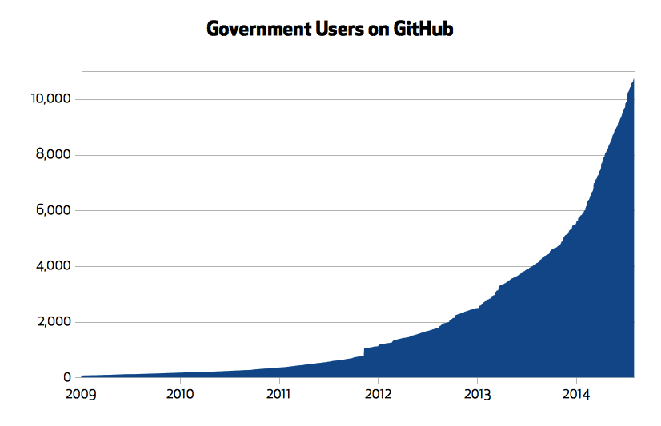
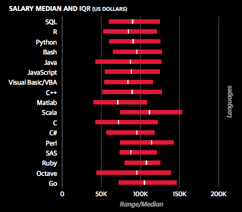
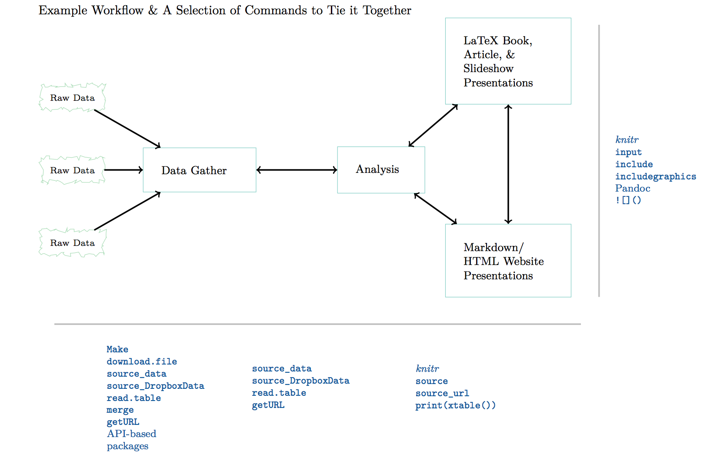
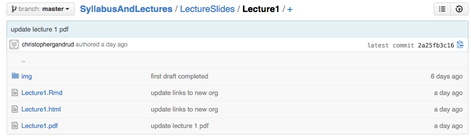
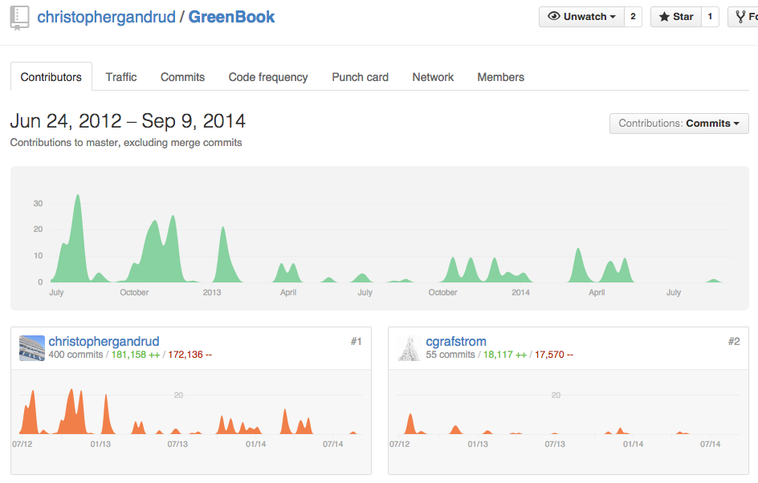

## Christopher Gandrud

**Contact**:

- Public

    + <a href="https://github.com/HertieDataScience2014/SyllabusAndLectures/issues"><i class="fa fa-exclamation-circle"></i> SyllabusAndLectures/issues</a>

    + <a href="https://twitter.com/ChrisGandrud"><i class="fa fa-twitter"></i> @ChrisGandrud</a>

- Private

    + <a href="mailto:gandrud@hertie-school.org"><i class="fa fa-envelope"></i> gandrud@hertie-school.org</a>

**Official Office Hours**:

- Room: 1.52

- Wednesday 15:00-17:00

## <i class="fa fa-arrow-circle-o-up"></i> Objectives for the week

- Introduce the course goals, plan, and expectations/assessment

- Introduce Collaborative & Reproducible Data Analysis

- Set up computational research environment

## <i class="fa fa-arrow-circle-o-up"></i> Objectives for the course

**Collaboratively** and **reproducibly**

- Gather/clean social data

- Analyse it

- Present results (in a variety of mediums)

<br>
<br>

<i class="fa fa-exclamation"></i> Learn how to actually **do** data analysis
using **best practices** <i class="fa fa-exclamation"></i>

We are going to use **ugly real-world data**, not pristine training data sets.

## <i class="fa fa-compass"></i> Motivation: Academic

- Skills needed to do **original quantitative research** for your **thesis**.

    + The final project will be a **trial version** of your thesis.

- State-of-the-art tools needed for **future high-level academic research**.

    + Take advantage of new data sources.

    + Avoid effort duplication.

    + Make your research reproducible.

    + Present your results in multiple forums.

## <i class="fa fa-compass"></i> Motivation: Government

- Government agencies are increasingly adopting the technologies and methods
of open data science.

[](https://github.com/blog/1874-government-opens-up-10k-active-government-users-on-github)

## <i class="fa fa-compass"></i> Motivation: Government

- Public data is increasingly **accessible**.

    + e.g. [World Bank Development Indicators](http://data.worldbank.org/data-catalog/world-development-indicators),
    [GovData Germany](https://www.govdata.de/neues), [data.gov.uk](http://data.gov.uk/),
    [New York City](https://nycopendata.socrata.com/),
    [data.gov](https://www.data.gov/open-gov/)

- Governments rely on data analysis for evidence based decision-making.

    + Tools of open data analysis enable better use of data **within** and **between**
    government actors.

    + Governments can take advantage of analyses done by **third parties**.

## <i class="fa fa-compass"></i> Motivation: Government

- They are also **sharing** and **collaboratively** developing code; **reducing
development costs** and **improving applications**.

- Version control to **increase engagement with the legislative process**.

    + San Francisco laws are now [<i class="fa fa-code-fork"></i>](https://help.github.com/articles/fork-a-repo)
    [forkable](https://github.com/SFMOCI/openlaw).

## <i class="fa fa-compass"></i> Motivation: Business

- Data analysis and R programming skills in particular are **highly valued** in
businesses such as finance and management.



Source: [Revolution Analytics](http://blog.revolutionanalytics.com/2014/02/r-salary-surveys.html)

## <i class="fa fa-question-circle"></i> Why Collaborative?

- Research is collaborative (even if you don't know it).

- Need tools and shared best practices to enable effective collaboration between
**explicit research partners**.

- Need tools and shared best practices to enable collaboration between researchers
who are **not explicitly** working together often in **unexpected ways**.

    + **Avoids effort duplication**

    + Enables **cumulative knowledge development**

- Tools for collaboration tend to enhance **reproducibility**.

## <i class="fa fa-question-circle"></i> What is reproducibility?

**Really reproducible** research (Peng 2011, 1226):

> <i class="fa fa-quote-left"></i> the data and code used to make a finding are
available and they are sufficient for an independent researcher to recreate the finding.
<i class="fa fa-quote-right"></i>

- In practice reproduciblity is enhanced by **literate programming** where the data,
analysis, and presentation of the results are 'weaved' or 'knitted' together.

    + Make available the research, **not just the advertising** for the findings (e.g.
    papers, book).

## <i class="fa fa-question-circle"></i> Reproducibility vs. Replication?

**Reproducibility**: an independent study makes the same findings using the
**same data** and **code** as the original researchers.

**Replicability**: an independent study makes the same conclusions as the original
using **other data, code, and even methods**,
i.e. independent verification.

## <i class="fa fa-question-circle"></i> Reproducibility vs. Replication?

<i class="fa fa-exclamation-triangle"></i> **''A study can be reproducible and still
be wrong''** [Peng 2014](http://simplystatistics.org/2014/06/06/the-real-reason-reproducible-research-is-important/).

E.g. a finding that is statistically significant in one study may remain statistically
significant when reproduced using the original data/code, but **replication studies
are unable to find a similar result**.

The original finding could just have been
[noise](http://andrewgelman.com/2014/09/03/disagree-alan-turing-daniel-kahneman-regarding-strength-statistical-evidence/).

## <i class="fa fa-question-circle"></i> Why reproducibility?

- **Replication** is the ''**ultimate standard**'' for judging scientific claims (Peng 2011).

- **Reproducibility**

    + **Enhances replication** (other researchers can understand how an analysis
    was actually done)

    + Is a **minimum standard** for judging scientific claims when replication is
    not possible.

## <i class="fa fa-question-circle"></i> Why reproducibility?

Reproducibility helps **avoid effort duplication**:

- Others don't need to waste time:

    + Gathering data that has already been gathered.

    + Discovering procedures that have already been discovered.

## <i class="fa fa-question-circle"></i> Why reproducibility?

- Reproducibility also makes it possible to **find and correct errors**.

    + Recent example: translation errors in the
    [World Values Survey](http://www.washingtonpost.com/blogs/monkey-cage/wp/2014/09/02/world-values-lost-in-translation/).

- Data errors can cause spurious findings that ultimately **waste researchers time**,
because they try to explain 'wrong' findings.

## <i class="fa fa-question-circle"></i> Why reproducibility?

- **Higher research impact**

    + Reproducible research is likely to be more **useful for other researchers**.
    They can use your data and learn from your code and methods.

- **Better work habits**

    + If you are thinking about reproducibility from the beginning your files
    will be **better organised** and your work will be **better documented**.

    + This allows you to **build on your own work** more effectively.

## <i class="fa fa-sitemap"></i> Reproducible Workflow

[](img/Workflow.png)

## <i class="fa fa-files-o"></i> Example of Truncated Workflow

This lecture is created using [RMarkdown](http://rmarkdown.rstudio.com/). It
allows me to create both PDF and HTML slides.



## <i class="fa fa-bookmark-o"></i> Practical Tips for Reproducible Research

- <i class="fa fa-pencil-square-o"></i> Document Everything!

- <i class="fa fa-file-code-o"></i> Everything is a (text) file.

- <i class="fa fa-smile-o"></i> All files should be human readable.

- <i class="fa fa-link"></i> Explicitly tie your files together.

- <i class="fa fa-list-ol"></i> Have a plan to organise, store, and make your files available.

## <i class="fa fa-check"></i> Course Prerequisites

- **Introductory-level statistics**

    + Basic descriptive statistics (e.g. data types, ways of describing distributions)

    + Basic inferential statistics: (significance testing, linear regression)

    + Exposure to statistics software (e.g. SPSS, STATA)

- Knowledge of particular software or computer programming is **not expected**

- <i class="fa fa-exclamation-triangle"></i> **Patience**

    + Work hard so you can be lazy.

## <i class="fa fa-list"></i> Course Outline (1)

**Part I: Motivation and Getting Started**

- Introduction to the Course

- Files, Files Structures, Version Control, and Collaboration

- Introduction to the R Programming Language

**Part II Markup Languages and Literate Programming**

- Introduction to Markup Languages and Literate Programming (1)

- Introduction to Markup Languages and Literate Programming (2)

## <i class="fa fa-list"></i> Course Outline (2)

**Part III: Data Gathering, Trasformations, and Analysis**

- Automatic Data Gathering via Curl, API Packages + Cleaning

- Automatic Data Gathering via Web Scraping

- Statistical Modelling with R

**Part IV: Communicating Results from Statistical Analyses**

- Automatic Table Generation and Static Visualisation

- Dynamic Visualisation

**Part V: Collaborative Research Project**

## <i class="fa fa-sort-numeric-asc"></i> Typical Class Plan

- ~ 1 hour lecture

- ~ 1 hour seminar

    + **Apply** what we learned in the lecture/readings to achieve specific goals,
    i.e. **no set pattern** to copy by rote.

    + **Pair programming**: work together with others to acheive these goals.

    + **Documentation**: document your work with Git/GitHub.

        - <i class="fa fa-exclamation"></i> Your seminar work should be **reproducible**.

        - It should be **useful** to your **future self** and **others**.

## <i class="fa fa-certificate"></i> Assessment


- 3 Pair Assignments (Weeks 3, 6, 9)

    + 10% each

- Collaborative Research Project (Presentation: Week 12, Website/Paper: Exam Week)

    + 50%

- Attendance & Active Participation

    + 20%

- <i class="fa fa-exclamation-triangle"></i> No traditional midterm or final exam

## <i class="fa fa-certificate"></i> Assessment Details (1)

- <i class="fa fa-upload"></i> All assignments must be developed and submitted
electronically on [<i class="fa fa-github"></i> GitHub](https://www.github.com).

- <i class="fa fa-exclamation-triangle"></i> Late assignments: -10% every day that
the assignment is late.

- All assignments must be completed in **pairs**.

    + Each pair member receives the same score

    + <i class="fa fa-exclamation-triangle"></i> Exception: very large discrepancy in
    [contributor statistics](https://help.github.com/articles/about-repository-graphs)

---

[](https://github.com/christophergandrud/GreenBook/graphs/contributors)

## <i class="fa fa-certificate"></i> Assessment Details (2)

- All assignments must be **reproducible**.

- **Due**: Midnight on Friday of the week it is due.

- More details will be given on the specific pair assignments/research project in
future classes.

## <i class="fa fa-certificate"></i> Assessment (attendance, participation)

- Usual Hertie Rules for attendance (examination rules §4)

- Participation:

    + **Traditional Participation**, e.g. engaging in class discussions, doing readings

    + **Non-Traditional Participation**: [pair programming](http://en.wikipedia.org/wiki/Pair_programming)
    in seminars, document your seminar work on GitHub,
    [pull request](https://help.github.com/articles/using-pull-requests)
    to the course repository (syllabus/lecture slides) and other groups' projects

## Syllabus & Lecture Slides

<https://github.com/HertieDataScience2014/SyllabusAndLectures>

**Syllabus** (<a href="https://github.com/HertieDataScience2014/SyllabusAndLectures/blob/master/README.md">README.md</a>)

- The syllabus will be **updated**. **Check regularly**.

    + Course **difficulty** is **monotonically decreasing** from the original
    (11 September) baseline.

**Lecture Slides** (<a href="https://github.com/HertieDataScience2014/SyllabusAndLectures/tree/master/LectureSlides">LectureSlides/</a>)

- Accessible as both HTML (recommended) or PDF.

- Slides will be **optimized for the web**.

## <i class="fa fa-book"></i> Reading

**Core Texts**

- Gandrud, Christopher. 2013. *Reproducible Research with R and RStudio*.
Chapman & Hall/CRC Press, Oxford. (RRRR)

- Crawley, Michael J. 2005. *Statistics: An Introduction Using R*. John Wiley
and Sons Ltd., Chichester.

<i class="fa fa-archive"></i> Both are available in the library.

<br>

**Other readings** generally available online (see syllabus) or I will make a copy
available.

## <i class="fa fa-list-ol"></i> Seminar to-do

- <i class="fa fa-users"></i> Meet each other, get idea of background.

- <i class="fa fa-download"></i> Setup software (all software is free).

    + **Highly recommended**: use your own <i class="fa fa-laptop"></i> laptop

## <i class="fa fa-globe"></i> Modern Web browser

- Make sure you have a modern web browser, e.g.:

    + <i class="fa fa-google"></i> Chrome

## <i class="fa fa-github"></i> GitHub

Setup Git/GitHub for version control, collaboration, and remotely storing your files.

- <i class="fa fa-user"></i> Set up (free) GitHub account: <https://github.com/join>

- **Give me your GitHub username** so that I can add you to the **HertieDataScience2014**
group (<https://github.com/HertieDataScience2014>).

- <i class="fa fa-download"></i> Install GitHub application:

    + Mac: <https://mac.github.com/>

    + Windows: <https://windows.github.com/>

## <i class="fa fa-code"></i> Statistics software

- <i class="fa fa-download"></i> **Install** software:

    + R: <http://cran.rstudio.com/>

    + RStudio (dev build): <http://www.rstudio.org/download/daily/desktop/>

- <i class="fa fa-terminal"></i> Make sure that you can install R packages:

```{r, eval=FALSE}
# Install the ggplot2 package
install.packages('ggplot2')

# Check to see if it loads properly
library(ggplot2)

ggplot(mtcars, aes(hp, mpg)) + geom_point()
```

## Expected Test Result

```{r include=FALSE}
library(ggplot2)
```

```{r fig.height=4}
ggplot(mtcars, aes(hp, mpg)) + geom_point()
```

## <i class="fa fa-font"></i> LaTeX

- <i class="fa fa-download"></i> Install a LaTeX distribution. Creates well formatted
PDF versions of your presentation documents.

    + Mac: <https://tug.org/mactex/>

    + Windows: <http://miktex.org/download>

- <i class="fa fa-exclamation-triangle"></i> This is a large download, so maybe do it in your spare time.

## <i class="fa fa-arrows-alt"></i> Pandoc

Install Pandoc. We won't use this directly, but it is needed for creating
presentation documents in multiple formats.

- <http://johnmacfarlane.net/pandoc/installing.html>

## Post-Installation

<i class="fa fa-play"></i> Play around with the software (especially RStudio)
