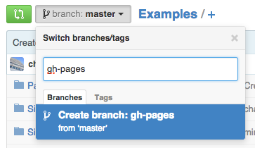
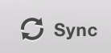

## <i class="fa fa-arrow-circle-o-up"></i> Objectives for the week

- Collaborative Research Project

- Review

- Static maps with ggmap

- Dynamic results presentation

    + Static website hosting with gh-pages


## Collaborative Research Project (1)

**Purpose**: Pose an interesting research question and try to answer it using
data analysis and standard academic practices. Effectively communicate your
results to a **variety of audiences** in a **variety of formats**.

**Deadline**:

- Presentation: In-class Friday 5 December

- Website/Paper: 12 December

## Collaborative Research Project (2)

The project is a 'dry run' for your thesis with multiple presentation outputs.

Presentation: 10 minutes **maximum**. **Engagingly** present your research
question and key findings to a general academic audience (fellow students).

Paper: 6,000 words maximum. Standard academic paper, properly cited laying out
your research question, literature review, data and methods, and findings.

Website: An engaging website designed to convey your research to **a general
audience**.

## Collaborative Research Project (3)

As always, you should **submit one GitHub repository** with all of the
materials needed to completely reproduce your data gathering, analysis, and
presentation documents.

**Note**: Because you've had two assignments already to work on parts of the
project, I expect **high quality work**.

## Review

- What is the data-ink ratio? Why is it important for effective plotting.

- What is visual weighting?

- Why should you avoid using the size of circles to mean anything in a plot?

- How many decimal places should you report in a table?

## ggmap

Last class we didn't have time to cover mapping with ggmap.

We've already seen how ggmap can be used to find latitude and longitude.

```{r, message=FALSE}
library(ggmap)

places <- c('Bavaria', 'Seoul', '6 Parisier Platz, Berlin',
            'Hertie School of Governance')

geocode(places)
```

## ggmap: get the map

```{r, message=FALSE}
qmap(location = 'Berlin', zoom = 15)
```

## Plot Houston crime with ggmap

Example from:
[Kahle and Wickham (2013)](http://journal.r-project.org/archive/2013-1/kahle-wickham.pdf)

Use *crime* data set that comes with ggmap

```{r}
names(crime)
```

## Clean data

```{r message=FALSE}
# find a reasonable spatial extent
qmap('houston', zoom = 13) # gglocator(2) see in RStudio
```

## Clean data

```{r}
# only violent crimes
violent_crimes <- subset(crime,
    offense != "auto theft" & offense != "theft" &
    offense != "burglary")

# order violent crimes
violent_crimes$offense <- factor(violent_crimes$offense,
    levels = c("robbery", "aggravated assault", "rape", "murder"))

# restrict to downtown
violent_crimes <- subset(violent_crimes,
    -95.39681 <= lon & lon <= -95.34188 &
    29.73631 <= lat & lat <= 29.78400)
```

## Plot crime data

```{r, message=FALSE}
# Set up base map
HoustonMap <- qmap("houston", zoom = 14,  
                   source = "stamen", maptype = "toner",
                   legend = "topleft")

# Add points
FinalMap <- HoustonMap +
                geom_point(aes(x = lon, y = lat, colour = offense, 
                               size = 100, alpha = 0.8),
                data = violent_crimes) +
                guides(size = FALSE, alpha = FALSE,
                       colour = guide_legend(title = 'Offense'))
```

---

```{r}
print(FinalMap)
```

## Interactive visualisations

When your output documents are in **HTML**, you can create interactive
visualisations.

Potentially more engaging and could let users explore data on their own.

## Interactive visualisations

Big distinction:

**Client Side**: Plots are created on the user's (client's) computer. Often
JavaScript in the browser. You simply send them static HTML/JavaScript needed for
their browser to create the plots.

**Server Side**: Data manipulations and/or plots (e.g. with Shiny Server) are
done on a server.

There are lots of **free** services (e.g. GitHub Pages) for hosting webpages for
client side plot rendering.

You usually have to use a **paid** service for server side data manipulation
plotting.

## Set up

You already know how to create HTML documents with R Markdown.

There are a growing set of tools for interactive plotting:

- [googleVis](https://code.google.com/p/google-motion-charts-with-r/)

- [dygraphs](http://rstudio.github.io/dygraphs/)

- [rcharts](http://rcharts.io/)

- [ggvis](http://ggvis.rstudio.com/)

- [networkD3](http://christophergandrud.github.io/networkD3/)

## Google Plots with googleVis

You can use the googleVis package to create Google plots from R.

Example from
[googleVis Vignettes](http://cran.r-project.org/web/packages/googleVis/vignettes/googleVis_examples.html).

```{r}
# Create fake data
fake_compare <- data.frame(
                country = c("US", "GB", "BR"),
                val1 = c(10,13,14),
                val2 = c(23,12,32))
```

## googleVis simple example

```{r, message=FALSE}
library(googleVis)
line_plot <- gvisLineChart(fake_compare)
print(line_plot, tag = 'chart')
```

**Note**: Uses `results='asis' in the code chunk head.

To show the in R use `plot` instead of `print` and don't include
`tag = 'chart'`.

## Map with googleVis

```{r, message=FALSE}
library(WDI)
co2 <- WDI(indicator = 'EN.ATM.CO2E.PC', start = 2010, end = 2010)
co2 <- co2[, c('iso2c','EN.ATM.CO2E.PC')]

# Clean
names(co2) <- c('iso2c', 'CO2 Emmissions per Capita')
co2[, 2] <- round(log(co2[, 2]), digits = 2)

co2_map <- gvisGeoMap(co2, locationvar = 'iso2c',
                      numvar = 'CO2 Emmissions per Capita',
                      options = list(
                          colors = '[0xfff7bc, 0xfec44f,
                                    0xd95f0e]'
                          ))
```

**Note**: That `0x` replaces `#` for hexadecimal colors.

---

CO2 Emmissions (metric tons per capita)

```{r, results='asis'}
print(co2_map, tag = 'chart')
```

## googleVis Maps in RStudio

<br>
<br>
<br>

Note: you will need to view googleVis maps that are in R Markdown documents in
your *browser* rather than RStudio's built in HTML viewer.

## Plot time series with dygraphs

Use the dygraphs package to plot interactive time series using the
[dygraphs](http://dygraphs.com/) JavaScript library.

Not on CRAN yet, so install from GitHub

```{r, eval=FALSE}
devtools::install_github(c('rstudio/htmltools',
                           'ramnathv/htmlwidgets',
                           'rstudio/dygraphs'))
```

## dygraphs example (1)

```{r}
library(dygraphs)
lungDeaths <- cbind(mdeaths, fdeaths)
dygraph(lungDeaths)
```

## dygraphs example (2)

```{r}
dygraph(lungDeaths) %>% dyRangeSelector()
```


## Network data with networkD3

```{r, eval=FALSE}
library(networkD3)
data(MisLinks); data(MisNodes)
forceNetwork(Links = MisLinks, Nodes = MisNodes,
            Source = "source", Target = "target",
            Value = "value", NodeID = "name",
            Group = "group", opacity = 0.8)
```

## Network data with networkD3

```{r, echo=FALSE}
library(networkD3)
data(MisLinks); data(MisNodes)
forceNetwork(Links = MisLinks, Nodes = MisNodes,
            Source = "source", Target = "target",
            Value = "value", NodeID = "name",
            Group = "group", opacity = 0.8)
```

## Hosting a website on GitHub Pages

Any file called *index.html* in a GitHub **repository branch** called
*gh-pages* will be a hosted website.

The URL will be:

`http://GITHUB_USER_NAME.github.io/REPO_NAME`

Note: you can use a custom URL if you own one. See
<https://help.github.com/articles/setting-up-a-custom-domain-with-github-pages/>

## Set Up GitHub Pages

First create a new branch in your repository called `gh-pages`:



## Set Up GitHub Pages

Then sync your branch with the local version of the repository.



Finally switch to the gh-pages branch.


## GitHub Pages and R Markdown

You can use R Markdown to create the index.html page as before.

Simply place a new .Rmd file in the repository called `index.Rmd` and
knit it to HTML. Then push it back up.

Your website will now be live.

## Seminar

Begin to create a website for your project with static and interactive graphics.

If relevant include: 

- A table of key results

- A googleVis map

- A bar or line chart with googleVis or other

- A simulation plot created with Zelig showing key results from your regression 
analysis.
