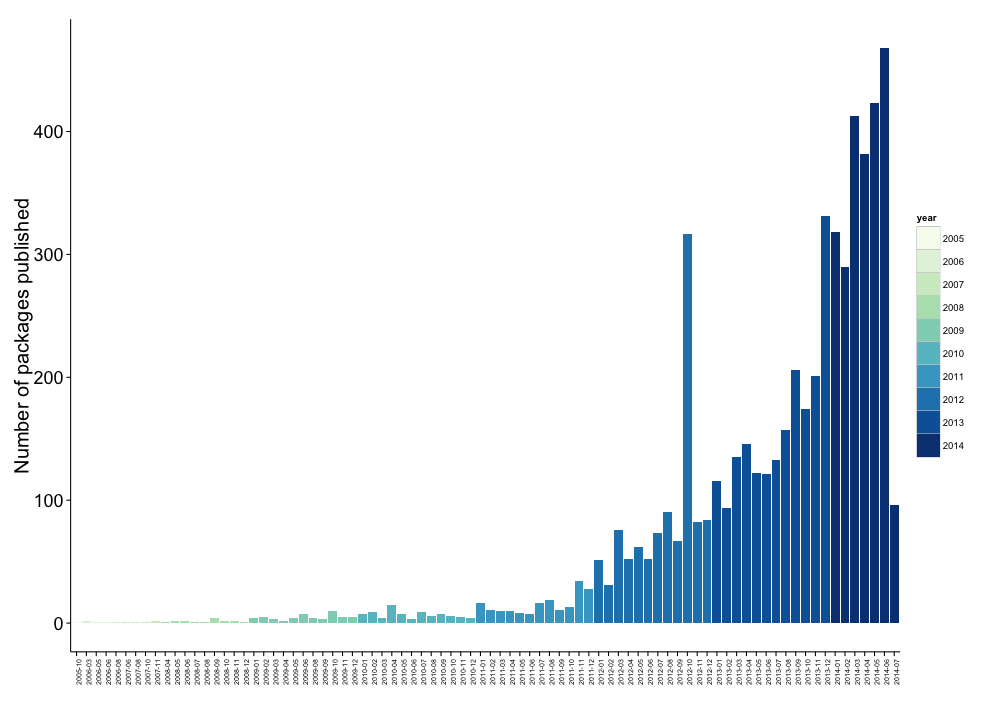

## <i class="fa fa-arrow-circle-o-up"></i> Objectives for the topic

- Basics of object-oriented programming in R

- Simple R data structures

- Simple descriptive statistics, (some) inferential statistics, and plotting with Base R

- (A few) programming best practices

## <i class="fa fa-question-circle"></i> What is R?

**Open source programming language**, with a particular focus on statistical programming.

**History:** Originally (in 1993) an implementation of the S programming language (Bell Labs), by
**R**oss Ihaka and **R**obert Gentleman (hence **R**) at University of Auckland.

Currently the R Foundation for Statistical Computing is based in Vienna.
Development is distributed globally.

**RStudio**:

RStudio is an Integrated Developer Environment (IDE) that makes using R 
and other reproducible research tools easier.

## <i class="fa fa-line-chart"></i> Comparative Google Search Interest

```{r echo=FALSE, message=FALSE, warning=FALSE}
library(rio)
library(tidyr)
library(lubridate)
library(ggplot2)

searches <- import('data/google_trends_results.csv')
searches$Week <- ymd(searches$Week)

searches <- gather(searches, Program, interest, 2:5)

ggplot(searches, aes(Week, interest, group = Program, colour = Program)) +
    geom_line(alpha = 0.3) +
    geom_smooth(se = F) +
    xlab('') + ylab('Interest\n') +
    theme_bw()

```

## <i class="fa fa-line-chart"></i> Growing popularity

R can be easily expanded by **user created packages**  hosted on GitHub and/or
[CRAN](http://cran.r-project.org/).

[](http://www.r-bloggers.com/analyzing-package-dependencies-and-download-logs-from-rstudio-and-a-start-towards-building-an-r-recommendation-engine/)

## How to Cite R

```{r}
citation()
```

## Fundamentals of the R language

Like many other popular programming languages, R is **object-oriented**.

**Objects are R's nouns**. They include (not exhaustive):

- character strings (e.g. words)

- numbers

- vectors of numbers or character strings

- matrices

- data frames

- lists

## R is a Calculator

```{r}
2 + 3

2 - 3

2 * 3

2 / 3
```

## Assignment

You use the **assignment operator** (`<-`) to assign character strings,
numbers, vectors, etc. to object names

```{r}
## Assign the number 10 to an object called number
number <- 10

number
```

```{r}
# Assign Hello World to an object called words
words <- "Hello World"

words
```

## Assignment

You can assign almost anything to an object. For example, the output of a maths operation:

```{r}
divided <- 2 / 3

divided
```

## Assignment

You can also use the equality sign (`=`):

```{r}
number = 10

number
```

Note: it has a slightly different meaning.

See [StackOverflow](http://stackoverflow.com/questions/1741820/assignment-operators-in-r-and)
discussion.

## Special values in R

- `NA`: not available, missing

- `NULL`: does not exist, is undefined

- `TRUE`, `T`: logical true. **Logical** is also an object class.

- `FALSE`, `F`: logical false

## Finding special values

| Function  | Meaning              |
| --------- | -------------------- |
| `is.na`   | Is the value `NA`    |
| `is.null` | Is the value `NULL`  |
| `isTRUE`  | Is the value `TRUE`  |
| `!isTRUE` | Is the value `FALSE` |

<br>

```{r}
absent <- NA
is.na(absent)
```

---

| Operator | Meaning                  |
| -------- | ------------------------ |
| `<`      | less than                |
| `>`      | greater than             |
| `==`     | equal to                 |
| `<=`     | less than or equal to    |
| `>=`     | greater than or equal to |
| `!=`     | not equal to             |
| `a | b`  | a or b                   |
| `a & b`  | a and b                  |

## Classes

Objects have distinct classes.

```{r}
# Find the class of number
class(number)

# Find the class of absent
class(absent)
```

## Naming objects

- Object names **cannot have spaces**

    + Use `CamelCase`, `name_underscore`, or `name.period`

- Avoid creating an object with the same name as a function (e.g. `c` and `t`) or
special value (`NA`, `NULL`, `TRUE`, `FALSE`).

- Use **descriptive object names**!

    + Not: `obj1`, `obj2`

- Each object name must be **unique** in an environment.

    + <i class="fa fa-exclamation"></i> Assigning something to an object name that is already in use will **overwrite
    the object's previous contents**.

## Finding objects

```{r}
# Find objects in your workspace
ls()
```

Or the *Environment* tab in RStudio

## Style Guides

As with natural language writing, it is a good idea to stick to one style guide
with your R code:

- [Google's R Style Guide](https://google-styleguide.googlecode.com/svn/trunk/Rguide.xml)

- [Hadely Wickham's R Style Guide](http://r-pkgs.had.co.nz/style.html)

## Vectors

A vector is an **ordered collection** of numbers, characters, etc. of the
**same type**.

Vectors can be created with the `c` (**combine**) function.

```{r}
# Create numeric vector
numeric_vector <- c(1, 2, 3)

# Create character vector
character_vector <- c('Albania', 'Botswana', 'Cambodia')
```

## Factor class vector

Categorical variables are called **factors** in R.

```{r}
# Create numeric vector
fruits <- c(1, 1, 2)

# Create character vector for factor labels
fruit_names <- c('apples', 'mangos')

# Convert to labelled factor
fruits_factor <- factor(fruits, labels = fruit_names)

summary(fruits_factor)
```

## Matrices

Matrices are collections of vectors **with the same length and class**.

```{r}
# Combine numeric_vector and character_vector into a matrix
combined <- cbind(numeric_vector, character_vector)

combined
```

Note (1): R *coerced* `numeric_vector` into a character vector.

Note (2): You can `rbind` new rows onto a matrix.

## Data frames

Data frames are collections of vectors with the same length.

Each column (vector) can be of a **different class**.

```{r}
# Combine numeric_vector and character_vector into a data frame
combined_df <- data.frame(numeric_vector, character_vector,
                          stringsAsFactors = FALSE)

combined_df
```

## Lists

A list is an object containing other objects that can have **different** lengths and classes.

```{r}
# Create a list with three objects of different lengths
test_list <- list(countries = character_vector, not_there = c(NA, NA),
                  more_numbers = 1:10)
test_list
```

## Functions

Functions do things to/with objects. Functions are like **R's verbs**.

When using functions to do things to objects, they are always followed by
parentheses `()`. The parentheses contain the **arguments**. Arguments are
separated by commas.

```{r}
# Summarise combined_df
summary(combined_df, digits = 2)
```

## Functions help

Use `?` to find out what arguments a function can take.

```{r, eval=FALSE}
?summary
```

The help page will also show the function's **default argument values**.

## Component selection (`$`)

The `$` is known as the component selector. It selects a component of an object.

```{r}
combined_df$character_vector
```

## Subscripts `[]`

You can use subscripts `[]` to also select components.

For data frames they have a `[row, column]` pattern.

```{r}
# Select the second row and first column of combined_df
combined_df[2, 1]


# Select the first two rows
combined_df[c(1, 2), ]
```

## Subscripts `[]`

```{r}
# Select the character_vector column
combined_df[, 'character_vector']
```

## Assigment with elements of objects

You can use assignment with parts of objects. For example:

```{r}
combined_df$character_vector[3] <- 'China'
combined_df$character_vector
```

You can even add new variables:

```{r}
combined_df$new_var <- 1:3
combined_df
```

## Packages

You can greatly expand the number of functions by installing and loading 
user-created packages.

```{r, eval=FALSE}
# Install dplyr package
install.packages('dplyr')

# Load dplyr package
library(dplyr)
```

You can also call a function directly from a specific package with the double
colon operator (`::`).

```{r, eval=FALSE}
Grouped <- dplyr::group_by(combined_df, character_vector)
```

## <i class="fa fa-table"></i> R's build-in data sets

List internal data sets:

```{r eval=FALSE}
data()
```

Load **swiss** data set:

```{r}
data(swiss)
```

Find data description:

```{r, eval=FALSE}
?swiss
```

## <i class="fa fa-table"></i> R's build-in data sets

Find variable names:

```{r}
names(swiss)
```

See the first three rows and four columns

```{r}
head(swiss[1:3, 1:4])
```

## What all the cool kids are doing: piping

**Pipe**: pass a value forward to a function call.

Why?

- Faster compilation.

- Enhanced code readability.

In R use `%>%` from the [dplyr](https://cran.rstudio.com/web/packages/dplyr/vignettes/introduction.html) package.

`%>%` passes a value to the **first argument** of the next function call.

## Simple piping example

Not piped:

```{r}
values <- rnorm(1000, mean = 10)
value_mean <- mean(values)
round(value_mean, digits = 2)
```

Piped:

```{r, message=FALSE}
library(dplyr)

rnorm(1000, mean = 10) %>% mean() %>% round(digits = 2)
```

## Creating Functions

You can create a function to find the sample mean
($\bar{x} = \frac{\sum x}{n}$) of a vector.

```{r}
fun_mean <- function(x){
    sum(x) / length(x)
}

## Find the mean
fun_mean(x = swiss$Examination)
```

## Why create functions?

Functions:

- Simplify your code if you do repeated tasks. 

- Lead to fewer mistakes.

- Are easier to understand.

- Save time over the long run--a general solution to problems in different
contexts.


## <i class="fa fa-area-chart"></i> Descriptive statistics: review

**Descriptive Statistics:** describe samples

Stats 101: describe sample **distributions** with appropriate measure of:

- **central tendancy**

- **variability**

## <i class="fa fa-area-chart"></i> Histograms

```{r}
hist(swiss$Examination)
```

## <i class="fa fa-area-chart"></i> Histograms: styling

```{r}
hist(swiss$Examination,
     main = 'Swiss Canton Draftee Examination Scores (1888)',
     xlab = '% receiving highest mark on army exam')
```

## Finding means

(or use the mean function in base R)

```{r}
mean(swiss$Examination)
```

If you have missing values (`NA`):

```{r, eval=FALSE}
mean(swiss$Examination, na.rm = TRUE)
```

## Digression: Loops

You can 'loop' through the data set to find the mean for each column

```{r}
for (i in 1:length(names(swiss))) {
    swiss[, i] %>%
    mean() %>%
    round(digits = 1) %>%
    paste(names(swiss)[i], ., '\n') %>%  # the . directs the pipe
    cat()
}
```

## Other functions for central tendency

**Median**

```{r}
median(swiss$Examination)
```

**Mode**

`mode` is not an R function to find the statistical mode.

Instead use `summary` for factor nominal variables or make a bar chart.

## Simple bar chart for nominal

```{r, message=FALSE, warning=FALSE, cache=TRUE}
devtools::source_url('http://bit.ly/OTWEGS')
plot(MortalityGDP$region, xlab = 'Region')
```

## Variation

Variation is "perhaps the **most important quantity** in statistical analysis. The 
greater the variability in the data, the greater will be our **uncertainty** in the 
values of the parameters estimated . . . and the **lower our ability to distinguish
between competing hypotheses**" (Crawley 2005, 33)


## Variation

**Range:**

```{r}
range(swiss$Examination)
```

**Quartiles:**

```{r}
summary(swiss$Examination)
```

## Variation

**Interquartile Range ($IQR = Q_{3} - Q_{1}$):**

```{r}
IQR(swiss$Examination)
```

## Variation

**Boxplots:**

```{r}
boxplot(swiss$Examination, main = '% of Draftees with Highest Mark')
```

## Variation: Sum of Squares 

**Sum of squares** (summing deviations from the mean):

$$\mathrm{Sum\:of\:Squares} = \sum(x - \bar{x})^2$$

- But sum of squares always gets bigger with a larger sample size.

    + Unless the new values exactly equal the mean.
    
## Variation: Degrees of Freedom

**Degrees of freedom** (number of values that are free to vary):

For the mean:

$$\mathrm{df} = n - 1$$

Why? 

For a given mean and sample size, $n - 1$ values can vary, but the $n$th 
value must always be the same. See Crawley (2005, 36-37).

## Variation: Variance

We can use degrees of freedom to create an "unbiased" measure of variability
that is not dependent on the sample size.

**Variance ($s^2$):**

$$
s^2 = \frac{\mathrm{Sum\:of\:Squares}}{\mathrm{Degrees\:of\:Freedom}} =
\frac{\sum(x - \bar{x})^2}{n - 1}
$$

But this is not in the same units as the mean, so it can be confusing to 
interpret. 

## Variation: Standard Deviation

Use standard deviation **($s$)** to put variance in terms of the mean:

$$s = \sqrt{s^2}$$

## Variation: Standard Error

The **standard error** of the mean:

If we think of the variation around a central tendency as a measure of the
**unreliability** of an estimate (mean) in a population,
then we want the measure to **decrease as the sample size goes up**.

$$
\mathrm{SE}_{\bar{x}} = \sqrt{\frac{s^{2}}{n}}
$$

Note: $\sqrt{}$ so that the dimensions of the measure of unreliability and the 
parameter whose variability is being measured are the same.

Good overview of variance, degrees of freedom, and standard errors in Crawley 
(2005, Ch. 4).

## Variation: Variance and Standard Deviation

**Variance:**

```{r}
var(swiss$Examination)
```

**Standard Deviation:**

```{r}
sd(swiss$Examination)
```

## Variation: Standard Error

**Standard Error:**

```{r}
sd_error <- function(x) {
    sd(x) / sqrt(length(x))
}

sd_error(swiss$Examination)
```

## Playing with distributions

Simulated normally distributed data with SD of 30 and mean 50

```{r}
Normal30 <- rnorm(1e+6, mean = 50, sd = 30)
```

```{r, echo=FALSE, message=FALSE}
# Helpful information from StackExchange discussion
# http://stackoverflow.com/questions/3494593/shading-a-kernel-density-plot-between-two-points?lq=1
# Load zoo package
library(zoo)
library(ggplot2)

# Convert to data frame
Normal30 <- data.frame(Normal30)

# Find density for +/- 1 SD
DensityLower <- density(Normal30$Normal30, from = 20, to = 50)
DensityUpper <- density(Normal30$Normal30, from = 50, to = 80)

# Extract density values (y values)
YLower <- DensityLower$y
YUpper <- DensityUpper$y

# Extract x values
XLower <- DensityLower$x
XUpper <- DensityUpper$x

# Merge vectors into data frames
Lower <- data.frame(YLower, XLower)
Upper <- data.frame(YUpper, XUpper)

# Add zero variable so that the shaded area goes down to 0
Lower$Zero <- 0
Upper$Zero <- 0

# Upper and Lower colours
LowerC <- "#80B2CD"
UpperC <- "#4F6F80"

# Create density plot
ggplot(Normal30, aes(x = Normal30)) +
        geom_density() +
        geom_ribbon(data = Lower, aes(x = XLower, ymax = YLower, ymin = Zero),
                    fill = LowerC, alpha = 0.4) +
        geom_ribbon(data = Upper, aes(x = XUpper, ymax = YUpper, ymin = Zero),
                    fill = UpperC, alpha = 0.4) +
        geom_vline(xintercept = 50, colour = "red", linetype = "longdash") +
        annotate("text", x = 25, y = 0.015, label = "-1 SD", colour = LowerC) +
        annotate("text", x = 75, y = 0.015, label = "+1 SD", colour = UpperC) +
        scale_y_continuous(limits = c(0, 0.02)) +
        scale_x_continuous(breaks = c(-90, -50, 0, 20, 50, 80, 100, 150, 185),
                           labels = c(-90, -50, 0, 20, 50, 80, 100, 150, 185)) +
        xlab("\n Simulated Data") + ylab("Density\n") +
        theme_bw()
```

## Transform skewed data

Highly skewed data can be transformed to have a normal distribution.


Helps correct two violations of key assumptions: (a) non-linearity and (b) heteroskedasticity.

```{r, fig.height=3}
hist(swiss$Education, main = '')
```

## Natural log transformed skewed data

```{r}
log(swiss$Education) %>% hist(main = "Swiss Education")
```

## Transformations

The natural log transformation is only useful for data that **does not contain zeros**.

See <http://robjhyndman.com/hyndsight/transformations/> for suggestions on other
transformations such as Box-Cox and Inverse Hyperbolic Sine. 

## Joint distributions

```{r}
plot(log(swiss$Education), swiss$Examination)
```

## Summarise with correlation coefficients

```{r}
cor.test(log(swiss$Education), swiss$Examination)
```

## Summarise with loess

```{r, message=FALSE}
ggplot2::ggplot(swiss, aes(log(Education), Examination)) +
    geom_point() + geom_smooth() + theme_bw()
```

## Programming Hint (1)

<i class="fa fa-exclamation"></i><i class="fa fa-exclamation">
</i><i class="fa fa-exclamation"></i> ***Always close!***

In R this means closing:

- `()`

- `[]`

- `{}`

- `''`

- `""`

## Programming Hint (2)

There are usually **many ways to acheive the same goal**, but . . 

make your code as **simple as possible**.

- Easier to read.

- Easier to write (ultimately).

- Easier to find mistakes.

- Often computationally more efficient.

One way to do this is to **define things once**--e.g. use variables to contain
values and custom functions to contain multiple sequential function calls. 

## Programming Hint (2)

**Bad**

```{r}
mean(rnorm(1000))

sd(rnorm(1000))
```

## Programming Hint (2)

**Good**

```{r}
rand_sample <- rnorm(1000)

mean(rand_sample)

sd(rand_sample)
```

## <i class="fa fa-arrow-circle-o-up"></i> Seminar: Start using R!

- **Access** R data sets

- Explore the data and find ways to **numerically**/**graphically** describe it.

- Find and use R functions that were **not covered** in the lecture for exploring
and transforming your data.

- Create **your own function** (what it does is open to you).

- **Save your work** as a *.R* source file. You will need it for the next seminar.
