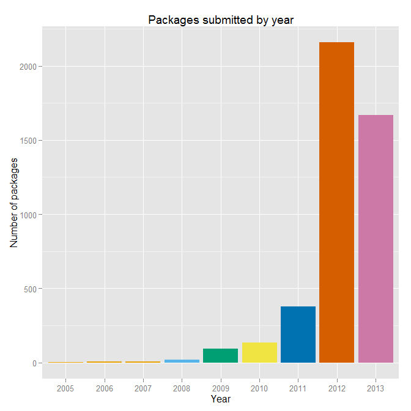

## <i class="fa fa-arrow-circle-o-up"></i> Objectives for the week

- Reminder: **Pair Assignment 1**

- Basics of object oriented programming in R

- R data structures

- Simple descriptive statistics and plotting

- Computer science problem solving skill

## <i class="fa fa-certificate"></i> Pair Assignment 1

- **Due:** Midnight 26 September.

- Learning objectives: develop your understanding of

    - **file structures**,

    - **version control**,

    - **basic R data structures** and **descriptive statistics**.

## <i class="fa fa-certificate"></i> Pair Assignment 1

Each pair will create a **new public GitHub repository**

- Must be **fully documented**, including with a **descriptive README.md**
    file.

- Include **R source** code files that:

    - Access at least **two** core R data sets

    - Illustrate the datas' distributions using a variety of **relevant
    descriptive statistics**

    - Two files must be **dynamically linked**

- **Another pair** makes a **pull request**. And this is discussed/merged.

## <i class="fa fa-question-circle"></i> What is R?

Open source programming language, with a particular focus on statistical programming.

**History:** Originally 1993 implementation of the S programming language (Bell Labs), by
**R**oss Ihaka and **R**obert Gentleman (hence **R**) at University of Auckland.

Currently the R Foundation for Statistical Computing is based in Vienna.

## <i class="fa fa-line-chart"></i> Growing popularity

R can be easily expanded by **user created packages**  hosted on GitHub and/or
[CRAN](http://cran.r-project.org/).

[](http://blog.revolutionanalytics.com/2013/05/how-r-grows.html)


## How to Cite R

```{r}
citation()
```

## Fundamentals of the R language

R is **object-oriented**.

**Objects are R's nouns**.

- a character string (e.g. word)

- a number

- a vector of numbers or character strings

- a matrix

- a data frame

## Assignment

You use the **assignment operator** (`<-`) to assign character strings, numbers,
vectors, etc. to object names

```{r}
## Assign the number 10 to an object called number
number <- 10

number
```

```{r}
# Assign Hello world to an object called word
word <- "Hello World"

word
```

## Naming objects

- Object names **cannot have spaces**

    + Use `CamelCase`, `name_underscore`, or `name.period`

- Avoid creating an object with the same name as a function (e.g. `c` and `t`).

- Each object name must be **unique** in a workspace.

    + Assigning something to an object name that is already in use will **overwrite
    the object's previous contents**.

```{r}
# Find objects in your workspace
ls()
```

## Classes

Objects have distinct classes.

```{r}
# Find the class of number
class(number)
```

## Style Guides

As with natural language writing, it is a good idea to stick to one style guide
with your R code:

- [Google's R Style Guide](https://google-styleguide.googlecode.com/svn/trunk/Rguide.xml)

- [Hadely Wickham's R Style Guide](http://r-pkgs.had.co.nz/style.html)

## Vectors

A vector is an **ordered list** of numbers, characters, etc. of the **same type**.

Vectors are created with the `c` (**concatenate**) function.

```{r}
# Create numeric vector
numeric_vector <- c(1, 2, 3)

# Create character vector
character_vector <- c('Albania', 'Botswana', 'Cambodia')
```

## Matrices

Matrices are collections of vectors **with the same length**

```{r}
# Combine numeric_vector and character_vector into a matrix
combined <- cbind(numeric_vector, character_vector)

combined
```

## Data frames

Data frames are collections of vectors with the same length.

Each column can be of a **different class**.

```{r}
# Combine numeric_vector and character_vector into a data frame
combined_df <- data.frame(numeric_vector, character_vector,
                          stringsAsFactors = FALSE)

combined_df
```

## Functions

Functions do things to objects. Functions are like **R's verbs**.

When using them to do things to objects, they are always followed by
parentheses `()`. The parentheses contain the **arguments**. Arguments are
separated by commas.

```{r}
# Summarise combined_df
summary(combined_df)
```

## Functions help

To find out what arguments a function can take use `?`.

```{r, eval=FALSE}
?summary
```

## Component selection (`$`)

```{r}
# Find the mean of numeric_vector
mean(x = combined_df$numeric_vector)
```

The `$` is known as the component selector. It selects a component of an object.

```{r}
combined_df$character_vector
```

## Subscripts `[]`

You can use subscripts `[]` to also select components.

For data frames they have a `[row, column]` pattern.

```{r}
# Select the second row and first column of combined_df
combined_df[2, 1]


# Select the first two rows
combined_df[c(1, 2), ]
```

## Subscripts `[]`

```{r}
# Select the character_vector column
combined_df[, 'character_vector']
```

## Packages

You can greatly expand the number of functions available to you by installing
and loading user-created packages.

```{r, eval=FALSE}
# Install dplyr package
install.packages('dplyr')

# Load dplyr package
library(dplyr)
```

You can also call a function directly from a specific package with the double
colon operator (`::`).

```{r, eval=FALSE}
Grouped <- dplyr::group_by(combined_df, character_vector)
```

## <i class="fa fa-table"></i> R's build-in data sets

List internal data sets:

```{r eval=FALSE}
data()
```

Load **swiss** data set:

```{r}
data(swiss)
```

Find data description:

```{r, eval=FALSE}
?swiss
```

## <i class="fa fa-table"></i> R's build-in data sets

Find variable names:

```{r}
names(swiss)
```

See the first three rows and four columns

```{r}
head(swiss[1:3, 1:4])
```

## <i class="fa fa-area-chart"></i> Descriptive statistics: review

**Descriptive Statistics:** describe samples

Stats 101: describe samples **distributions** with appropriate measure of

- **central tendancy**

- **variability**

## <i class="fa fa-area-chart"></i> Histograms

```{r}
hist(swiss$Examination)
```

## <i class="fa fa-area-chart"></i> Histograms: styling

```{r}
hist(swiss$Examination,
     main = 'Swiss Canton Draftee Examination Scores (1888)',
     xlab = '% receiving highest mark on army exam')
```

## Creating functions

You can create a function to find the sample mean
($\bar{x} = \frac{\sum x}{n}$) of a vector.

```{r}
fun_mean <- function(x){
    sum(x) / length(x)
}

## Find the mean
fun_mean(x = swiss$Examination)
```

## Loops

You can 'loop' through the data set to find the mean for each column

```{r}
for (i in 1:length(names(swiss))) {
    print(fun_mean(swiss[, i]))
}
```

## Finding means

(or use the mean function in base R)

```{r}
mean(swiss$Examination)
```

If you have missing values (`NA`):

```{r, eval=FALSE}
mean(swiss$Examination, na.rm = TRUE)
```

## Other functions for central tendency

**Median**

```{r}
median(swiss$Examination)
```

**Mode**

`mode` is not an R function to find the statistical mode.

Instead use `summary` for factor nominal variables or make a bar chart.

## Simple bar chart for nominal

```{r, message=FALSE, cache=TRUE}
devtools::source_url('http://bit.ly/OTWEGS')
plot(MortalityGDP$region, xlab = 'Region')
```

## Variation

**Range:**

```{r}
range(swiss$Examination)
```

**Quartiles:**

```{r}
summary(swiss$Examination)
```

## Variation

**Boxplots:**

```{r}
boxplot(swiss$Examination, main = '% of Draftees with Highest Mark')
```

## Variation

**Interquartile Range ($IQR = Q_{3} - Q_{1}$):**

```{r}
IQR(swiss$Examination)
```

## Variation: standard deviation

**Sum of squared deviations**:

$$\mathrm{Sum\:of\:Squares} = \sum(x - \bar{x})^2$$

**Degrees of freedom** (number of values that are free to vary):

$$\mathrm{df} = n - 1$$

**Variance ($s^2$):**

$$
s^2 = \frac{\mathrm{Sum\:of\:Squares}}{\mathrm{Degrees\:of\:Freedom}} = 
\frac{\sum(x - \bar{x})^2}{n - 1}
$$

**Standard deviation ($s$)** (in terms of the mean):

$$s = \sqrt{s^2}$$

## Variation: Standard Error

The **standard error** of the mean:

If we think of the variation as around a central tendancy as a measure of 
**unreliability** then we want the measure to **decrease as the sample size goes up**.

$$
\mathrm{SE}_{\bar{x}} = \frac{s}{\sqrt{n}}
$$

## Variation: Variance and Standard Deviation

**Variance:** 

```{r}
var(swiss$Examination)
```

**Standard Deviation:**

```{r}
sd(swiss$Examination)
```

## Variation: Standard Error

**Standard Error:**

```{r}
sd_error <- function(x) {
    sd(x) / sqrt(length(x))
}

sd_error(swiss$Examination)
```

## Playing with distributions

Simulated normally distributed data with SD of 30 and mean 50

```{r}
Normal30 <- rnorm(1e+6, mean = 50, sd = 30)
```

```{r, echo=FALSE, message=FALSE}
# Helpful information from StackExchange discussion
# http://stackoverflow.com/questions/3494593/shading-a-kernel-density-plot-between-two-points?lq=1
# Load zoo package
library(zoo)
library(ggplot2)

# Convert to data frame
Normal30 <- data.frame(Normal30)

# Find density for +/- 1 SD
DensityLower <- density(Normal30$Normal30, from = 20, to = 50)
DensityUpper <- density(Normal30$Normal30, from = 50, to = 80)

# Extract density values (y values)
YLower <- DensityLower$y
YUpper <- DensityUpper$y

# Extract x values
XLower <- DensityLower$x
XUpper <- DensityUpper$x

# Merge vectors into data frames
Lower <- data.frame(YLower, XLower)
Upper <- data.frame(YUpper, XUpper)

# Add zero variable so that the shaded area goes down to 0
Lower$Zero <- 0
Upper$Zero <- 0

# Upper and Lower colours
LowerC <- "#80B2CD"
UpperC <- "#4F6F80"

# Create density plot
ggplot(Normal30, aes(x = Normal30)) +
        geom_density() +
        geom_ribbon(data = Lower, aes(x = XLower, ymax = YLower, ymin = Zero), 
                    fill = LowerC, alpha = 0.4) +
        geom_ribbon(data = Upper, aes(x = XUpper, ymax = YUpper, ymin = Zero), 
                    fill = UpperC, alpha = 0.4) +
        geom_vline(xintercept = 50, colour = "red", linetype = "longdash") +
        annotate("text", x = 25, y = 0.015, label = "-1 SD", colour = LowerC) +
        annotate("text", x = 75, y = 0.015, label = "+1 SD", colour = UpperC) +
        scale_y_continuous(limits = c(0, 0.02)) +
        scale_x_continuous(breaks = c(-90, -50, 0, 20, 50, 80, 100, 150, 185), 
                           labels = c(-90, -50, 0, 20, 50, 80, 100, 150, 185)) +
        xlab("\n Simulated Data") + ylab("Density\n") + 
        theme_bw()
```

## Transform skewed data

Highly skewed data can be transformed to have a normal distribution


Helps correct two violations of key assumptions: (a) non-linearity and (b) heteroskedasticity. 

```{r, fig.height=3}
hist(swiss$Education, main = '')
```

## Natural log transformed skewed data

```{r}
hist(log(swiss$Education))
```

## Joint distributions

```{r}
plot(log(swiss$Education), swiss$Examination)
```

## Summarise with loess

```{r, message=FALSE}
ggplot2::ggplot(swiss, aes(log(Education), Examination)) +
    geom_point() + geom_smooth() + theme_bw()
```

## Programming Hint

<i class="fa fa-exclamation"></i><i class="fa fa-exclamation">
</i><i class="fa fa-exclamation"></i> ***Always close!***

In R this means closing

- `()`

- `[]`

- `{}`

- `''`

- `""`

## <i class="fa fa-arrow-circle-o-up"></i> Seminar: Start using R!

- **Access** R data sets 

- Explore the data and find ways to **numerically**/**graphically** describe it

- Find and use R functions that were **not covered** in the lecture for exploring
and transforming your data.

- Create **your own function** (what it does is open to you).
