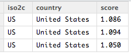
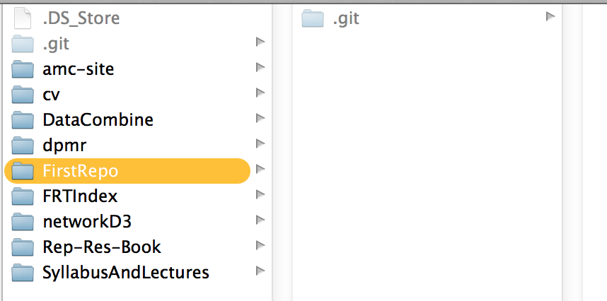
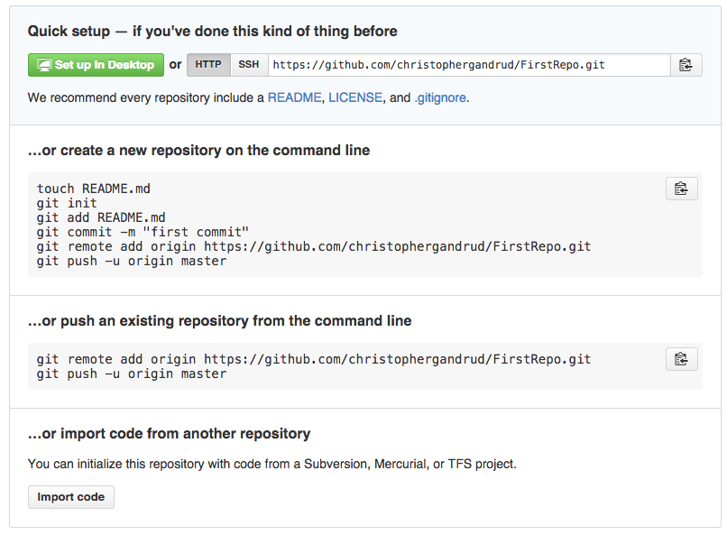
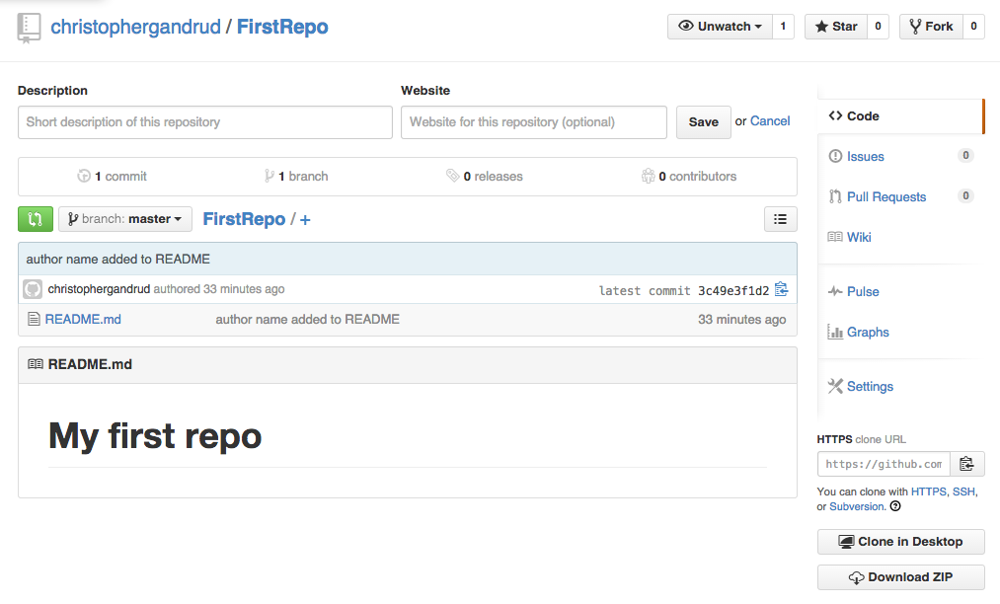
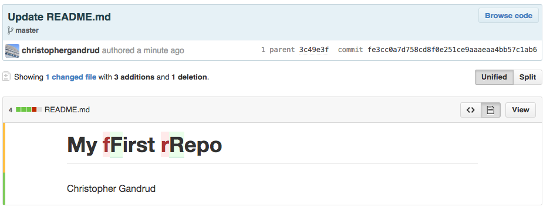
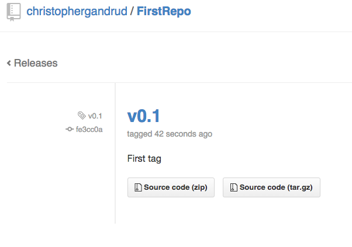

## <i class="fa fa-arrow-circle-o-up"></i> Objectives for the topic

- Introduce **Pair Assignment 1**

- **Importance** of (text) files and understanding files structures for reproducible
research

- Understanding **files paths** (conventions, best practices)

- **Accessing** the file system from **R**

- Introduction to Git/GitHub for **version control**

- Git/GitHub for **collaboration**


## <i class="fa fa-certificate"></i> Pair Assignment 1

- **Due:** Midnight 2 October

- Learning objectives: develop your understanding of

    - **file structures**,

    - **version control**,

    - **basic R data structures** and **descriptive statistics**.

## <i class="fa fa-certificate"></i> Pair Assignment 1

Each pair will create a **new public GitHub repository**

- Must be **fully documented**, including with a **descriptive README.md**
    file. Your code must be **human readable** and **clearly commented**.

- Include **R source** code files that:

    - Access at least **two** core R data sets

    - Illustrate the data's distributions using a variety of **relevant
    descriptive statistics**

    - Two files must be **dynamically linked**

- **Another pair** makes a **pull request**. And this is discussed/merged.

## <i class="fa fa-bookmark-o"></i> Remember: Practical Tips for Reproducible Research

- <i class="fa fa-pencil-square-o"></i> Document Everything!

- <i class="fa fa-file-code-o"></i> Everything is a (text) file.

- <i class="fa fa-smile-o"></i> All files should be human readable.

- <i class="fa fa-link"></i> Explicitly tie your files together.

- <i class="fa fa-list-ol"></i> Have a plan to organise, store, and make your files available.

## <i class="fa fa-bolt"></i> Importance of understanding files/file structures

- This topic may seem kind of . . . dry.

- Why not just click and drag files with the GUI (Graphical User Interface)?

## <i class="fa fa-bolt"></i> Importance of understanding files/file structures

- **Reproducibility**: other researchers only have your files. If they are **well
    organised** and the **links** between the files are **explicitly stated**
    then they can better understand what you did.

    + Clearest way of explicitly stating links is **dynamically** using file
    paths in your source code.

- **The software tools of really reproducible research**: R, RMarkdown, LaTeX, etc.
    all require you to explicitly state file paths.

- **You**: well organised files will be easier for you to find/understand/use
    in the future.

## <i class="fa fa-file-code-o"></i> Why text files?

(Almost) all files are ultimately text files.

- E.g. a website is typically just a series of connected `.html`, `.js`,
and `.css` files.

- **These are text files!** Despite different file extensions.

    + To see this explore a webpage with
    [Chrome Developer Tools](https://developer.chrome.com/devtools)

## <i class="fa fa-file-code-o"></i> Why text files?

Text files are **versitile**.

- Store your data (`.csv`), store your analysis code (`.R`), store your
presentation markup (`.Rmd`, `.tex`, `.bib`).

- They are **simple** and are **not dependent on particular software**.

    - Any text editor can open them.

- Helps **future-proof** research.

- Easy to **version control**.

## <i class="fa fa-file-code-o"></i> CSV Example

CSV (Comma Separated Values)

- All columns are separated by commas `,`.

- All rows are separated by new lines.

## <i class="fa fa-file-code-o"></i> CSV Example

In CSV this:

```
iso2c, country, score
US,United States,1.086
US,United States,1.094
US,United States,1.050
```

makes:



## <i class="fa fa-file-code-o"></i> Text files best practices

Use RStudio or some **text editor** (personal current favourite: [atom.io](https://atom.io/))
to edit text files.

- RStudio can open/edit/save any text file

<i class="fa fa-exclamation-triangle"></i> Never open/edit/save using MS Word!

- Word will add a lot of hidden background text that is likely to cause problems
with R and other software. R/etc doesn't understand Word's instructions.

## <i class="fa fa-file-code-o"></i> Text files best practices

Document your text files, including **informative headers**.

Use **comment characters** (R: `#`, Markdown/HTML: `<!-- -->`)

For example:

```{r, eval=FALSE}
#####################
# R source to gather World Bank data
# Christopher Gandrud
# 18 September 2015
# MIT License
####################

2 + 2 # Inline comment
```

## <i class="fa fa-file-code-o"></i> Text files best practices

+ Keep line length to about **80 characters**.

    + In Markdown/LaTeX paragraph breaks only exist if there are **two line
    breaks**.

    + Most text editors, including RStudio have a **margin ruler**.

    + Improves version control.

```{r eval=FALSE}
This is treated as
only one paragraph.

This is treated as

two paragraphs.
```

## <i class="fa fa-folder-open-o"></i> File paths

- Files are organised **hierarchically** into (upside down) trees.

```{r eval=FALSE}
Root
|_
    Parent
    |_
        Child1
        Child2
```

## <i class="fa fa-folder-open-o"></i> Root

**Root** directories are the **first level of a disk**.

They are the root out of which the file tree grows.

**Naming Conventions**:

**Linux/Mac**: `/`

- e.g. `/git_repos` means that the `git_repos` directory is a child
of the root directory.

**Windows**: the disk is partitioned, e.g. the `C` partition is denoted `C:\`.

- `C:\git_repos` indicates that the `git_repos` directory is a child
of the `C` partition.

## <i class="fa fa-folder-open-o"></i> Sub (child) directories

Sub (child) directories are denoted with a `/` in Linux/Mac and `\` in Windows, e.g.:

```{r engine='sh', eval=FALSE}
# Linux/Mac
/git_repos/Project1

# Windows
C:\git_repos\Project1
```

<i class="fa fa-exclamation"></i> R tip:

- In R for Windows you either use two backslashes `\\` (`\` is the R [escape
character](http://en.wikipedia.org/wiki/Escape_character))

- Or `/` in **relative paths** in R for Windows, it will know
what you mean.

## <i class="fa fa-folder-open-o"></i> Working directories

A **working directory** is the directory where the program looks for files/other
directories.

<i class="fa fa-exclamation"></i> **Always remember the working directory.**

- Otherwise you may open/save files that you do not want to open/save.

## <i class="fa fa-folder-open-o"></i> Working directories

**In R:**

```{r}
# Find working directory
getwd()

# List all files in the working directory
list.files()
```

```{r, eval=FALSE}
# Set root as working directory
setwd('/')
```

## <i class="fa fa-folder-open-o"></i> Extra: in the Terminal Shell

In the **Terminal Shell**:

```{r engine='sh'}
# Find working directory
pwd
```

```{r engine='sh', eval=FALSE}
# Set root as working directory
cd /
```

## <i class="fa fa-folder-open-o"></i> Relative vs. Absolute file paths

Use **relative file paths** when possible.

- **Absolute file path**: the entire path on a particular system,
    + E.g. `/git_repos/Project1/Paper.Rmd`

- **Relative file path**: the path relative to the working directory.

    + E.g. if `/git_repos` is the working directory then the relative path for
    `Paper.Rmd` is `Project1/Paper.Rmd`.

Why?

- Your scripts will run easily on **other computers**. **Enhances reproducibility**.
Easier for your collaborators. Easier for you when you use another computer.

## <i class="fa fa-folder-open-o"></i> File & directory name conventions

<i class="fa fa-exclamation-triangle"></i> **Don't use spaces** in your file names.

They can create problems for programs that treat spaces as an indication that the
path has ended.

Alternatives:

- `CamelCase` (ex. `DataAnalysis.R`)

- `file_underscore` (ex. `data_analysis.R`)

## <i class="fa fa-folder-open-o"></i> Load files into R--Dynamically Link

There are a number of R commands to load files, depending on the file type.

- Load Data: `read.table`, `read.csv` `read.dta` `xlsx::read.xlsx`,
`rio::import`

```{r, eval=FALSE}
read.csv('data/TestData.csv')
```

- Save Data: `write.csv`, `write.dta`

- Load and run R source code: `source`

```{r, eval=FALSE}
source('source/Analysis1.R')
```
## R Input Output, including from URLs

URLs are also file paths for files on the internet.

You can use them the same way as local file paths.

The new [rio](https://github.com/leeper/rio) package can import many different
file types (including from URLS) with the same function: `import`.

```{r}
library(rio)

Disproportionality <- import('http://bit.ly/Ss6zDO', format = 'csv')

names(Disproportionality)
```

## <i class="fa fa-github"></i> Version Control with Git

Why version control?

- Detailed log of **all changes**.

- Easy to **revert back** to previous versions.

- Clear **attribution of work** (who contributed what).

    + <i class="fa fa-child"></i> Provides a **selective incentive**, helping to
    overcome the collaborative collective action problem!

---

[](https://github.com/christophergandrud/GreenBook/graphs/contributors)


## <i class="fa fa-github"></i> Git vs. GitHub

What is [Git](http://git-scm.com/)?

- Git is an **open source** command line program for version control.

What is [<i class="fa fa-github"></i> GitHub](https://github.com/)?

- A **company/web service** that hosts Git repositories and enables 'social coding'.

- Other services are available, e.g. [BitBucket](https://bitbucket.org/)

- Note: ultimately your locally stored repositories are yours separate from GitHub.

## <i class="fa fa-github"></i> GUI GitHub

What is GitHub for Mac/Windows?

- A GUI for Git.

- Makes it easier to use.

- Ultimately just does command line Git.

## Note: Explaining using the command line

The following example uses command line Git, even though you are free to use
GUI GitHub.

Why?

- **Easier to document** (not just a bunch of screen shots).

- The command line Git is the '**real Git**'. GUI Git's are a facade, and more
likely to change/be different across implementations.

- Understanding command line Git will help you **understand problems and concepts
that arise later**.

## Getting started with Git

Key terms (local):

- **Repository** (repo): a directory where Git looks for changes

- **Initialize** (init): have Git begin watching a directory

- `add`: stage a file so that Git starts watching it

- `commit`: record changes to the repo

- `branch`: continuous history of the repository. You can have multiple branches

- **master**: the main branch. By convention this should be the most stable
version.

## Getting started with Git

Key terms (local):

- `checkout`: revert to a previous version or a branch

- `merge`: combine one branch into another

- `tag`: a human readable name given to a particular commit

- `blame`: attribution of who changed what

## Getting started with Git

Key terms (remote):

- *Collaborator*: someone with read/write permission on a repo

- `clone`: copy a remotely hosted repository onto your computer

- `push`: commit changes to a remotely hosted repository

- `pull`: merge changes from a remotely hosted repository

    + In GUI GitHub `push` and `pull` are combined into **sync**

- **fork**: copy a repository that you do not own

- **pull request**: after forking a repo, changes can be made and suggested to
the original repo's owner.

## <i class="fa fa-github"></i> Getting started with Git

Note: using command line (Terminal Shell), but all of these things can be done
with the GUI file system (point and click) + GitHub GUI.

First lets create a directory (`FirstRepo`) that will become our
**Git repository** (i.e. parent directory)

```{r engine='sh', eval=FALSE}
# Make repository directory
mkdir /git_repositories/FirstRepo

# Change working directory
cd /git_repositories/FirstRepo

# Begin version control by initialising as a Git repo
git init
```

## Getting started with Git



## <i class="fa fa-github"></i> Getting started with Git

Add a text file to the repo.

```{r engine='sh', eval=FALSE}
# Create a new file called README.md
echo "# My first repo" > README.md

# Check Git status
git status
```

```
# On branch master
#
# Initial commit
#
# Untracked files:
#   (use "git add <file>..." to include in what will be committed)
#
#    README.md
```

## <i class="fa fa-github"></i> Getting started with Git

**Note**: All repos should have an informative `README.md` file.

- `.md` is for [Markdown](https://help.github.com/articles/markdown-basics)

<i class="fa fa-star"></i> Bonus: They are **rendered on GitHub**. For example, the Syllabus on
[SyllabusAndLectures](https://github.com/HertieDataScience/SyllabusAndLectures).

## <i class="fa fa-github"></i> Getting started with Git

Begin tracking changes, by **staging** the repo's files.

```{r engine='sh', eval=FALSE}
git add .
```

Make some changes to `README.md`. Save the changes.

These changes will not be logged by Git until they are **committed**

```{r engine='sh', eval=FALSE}
git commit -am 'author name added to README'
```

- `a`: all changes are committed

- `m`: add a Git commit message. Try to be **informative**.

Also, compare to previous commits with `git diff`

## <i class="fa fa-github"></i> Git Log

You can view all previous commits with `git log`

```{r engine='sh', eval=FALSE}
git log
```

```
commit 3c49e3f1d2f03513c1554bb36d034562312b5bed
Author: christophergandrud <christopher.gandrud@gmail.co>
Date:   Tue Sep 9 15:54:44 2014 +0200

    author name added to README
```

## <i class="fa fa-github"></i> Git Checkout

Each commit is given a **unique SHA-1 hash**.

The hash in the previous example was: `3c49e3f1d2f03513c1554bb36d034562312b5bed`.

You can switch back to any previous commit with `git checkout` and the commit
hash.

Use `--` for the last commit.

```{r engine='sh', eval=FALSE}
git checkout --
```

## <i class="fa fa-github"></i> Add to GitHub

So far the repo is only on your own computer.

To add it to GitHub:

1. Create a new repository on GitHub. Give it the same name as you local repo (
i.e. `FirstRepo`). Do not initialise with any files.

2. Follow the instructions:

---



---

[](https://github.com/christophergandrud/FirstRepo)

## <i class="fa fa-github"></i> Updating From Remote Repositories

After you commit a change to the **local** repository you need to **push** the changes
to GitHub:

```{r engine='sh', eval=FALSE}
git push origin master
```

- `origin`: the remote repo on GitHub

- `master` is the master branch (we'll get to this in a second)

## <i class="fa fa-github"></i> Updating From Remote Repositories

If there are changes on the remote repo, then you will need to **pull** and **merge**
them.

```{r engine='sh', eval=FALSE}
git pull origin master
```

```
Unpacking objects: 100% (3/3), done.
From https://github.com/christophergandrud/FirstRepo
 * branch            master     -> FETCH_HEAD
   3c49e3f..fe3cc0a  master     -> origin/master
Updating 3c49e3f..fe3cc0a
Fast-forward
 README.md | 4 +++-
 1 file changed, 3 insertions(+), 1 deletion(-)
```

Git will tell you if there are any **merge confilcts**. You will need to sort these out.

## <i class="fa fa-github"></i> Comparing Commits on GitHub

View a file's `History`.

[](https://github.com/christophergandrud/FirstRepo/commit/fe3cc0a7d758cd8f0e251ce9aaaeaa4bb57c1ab6?short_path=04c6e90#diff-04c6e90faac2675aa89e2176d2eec7d8)

## <i class="fa fa-code-fork"></i> Branches

You can create multiple **branches** in your repo.

These allow you to:

- Make changes to a project without affecting the **master** branch

- A branch called **gh-pages** pushed to GitHub will become a hosted website.

## <i class="fa fa-code-fork"></i> Branches Example

Create a new branch called `TestBranch`

```{r engine='sh', eval=FALSE}
git checkout -B TestBranch
```

You can `add` files and `commit` changes.

When you think that the changes are ready to be merged with the `master` branch:

```{r engine='sh', eval=FALSE}
git commit -am 'last changes to TestBranch, ready for master'

git checkout master

git merge TestBranch

# Delete the branch if you want to
git branch -D TestBranch
```

## <i class="fa fa-tag"></i> Tags

You can **tag** a particular commit so that it is easy to find.

<i class="fa fa-exclamation"></i> You need to tag your assignments when you turn
them in.

```{r engine='sh', eval=FALSE}
git tag -a v0.1 -m 'First tag'

git push --tags
```

---



## <i class="fa fa-tag"></i> Tags and DOI

You can use GitHub tags to create [Digital Object Identifiers (DOI)](http://en.wikipedia.org/wiki/Digital_object_identifier).

- Use for **citing** (particular version of) research.

- For **How-To** see <https://guides.github.com/activities/citable-code/>

DOI Badges in README files on GitHub:


## <i class="fa fa-table"></i> Data on GitHub

CSV files are rendered in the browser:


## <i class="fa fa-users"></i> Collaborating on GitHub: Official Collaborators

You can add **official collaborators** to the repo on GitHub:

Settings > Collaborators > Enter collaborator's GitHub username

Now the will have read/write privileges (they can **push** as well as **pull**)

They should **clone** the repo.


## <i class="fa fa-exclamation-circle"></i> GitHub Issues

A good way to communicate is to use GitHub Issues.

Creates an open and public record of thoughts/issues that anyone can contribute to.

## <i class="fa fa-code-fork"></i> Forking/Pull Requests

**Fork:** You can copy a repo and then build on it by <i class="fa fa-code-fork"></i>
**forking** it.

- This maintains entire version history, contributors, etc,

**Pull:** Anyone (non-official contributors) can make a **pull request**.

Simplest way is to click edit (<i class="fa fa-pencil"></i>) on someone else's
repo. Begin editing.

Note:

- Need approval from a repo owner

- Once the request is accepted, the change is **automatically merged**
into master.

## <i class="fa fa-github"></i> GitHub Caveats

**Cannot store large files** (> 50 mb).

Public repos are public! So **never put a password** or other sensitive information
in them.

- If you want Git/GitHub to **ignore** a file in your local repo, place its file path
 in a file called `.gitignore`.

- For efficiency can use
[regular expressions](http://en.wikipedia.org/wiki/Regular_expression)

    + For example to ignore all PDF files use:

```{r, eval=FALSE}
*.pdf
```

## <i class="fa fa-arrow-circle-o-up"></i> Seminar: Files/File Paths

Play around with the file system from R (and if you want to) the Shell

- Find the working directory, change the working directory, explore the files
in the working directory.

If you have any data files, try to load them into R.

- If not load `Data/MainData.csv` into R from
<https://github.com/christophergandrud/Rep-Res-ExampleProject1>.

## <i class="fa fa-arrow-circle-o-up"></i> Seminar: Git/GitHub

- Create a new **remote repository** on GitHub and **clone** it to your computer.

- Add and commit you your *.R* file from the previous seminar and a README.md 
file.

- Add your neighbour as a **collaborator** to the repo.

- Make, push, and pull commits from each other.

- Open and close issues.

- Fork a neighbour's repo.

- Make a pull request to another neighbour's repo (or the
[SyllabusAndLectures](https://github.com/HertieDataScience/SyllabusAndLectures)).
Justify why it is an important request.

- Accept (or reject) a pull request.
