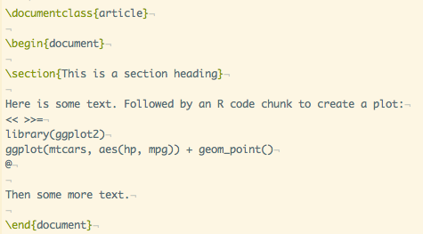
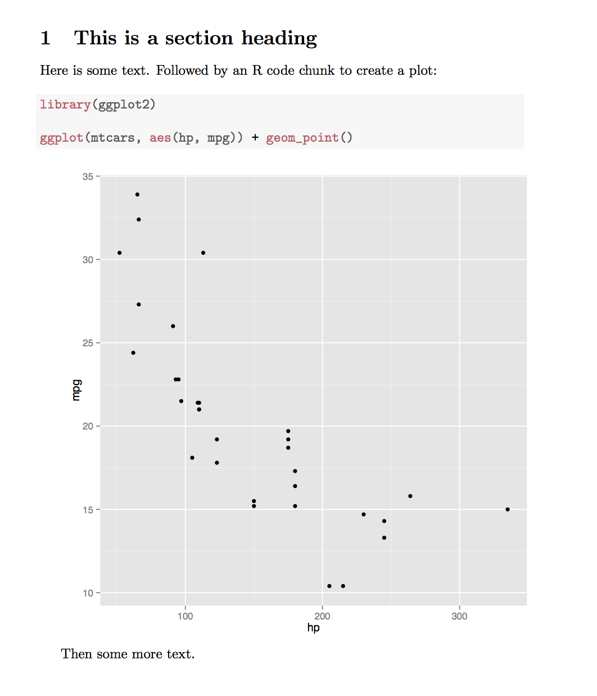
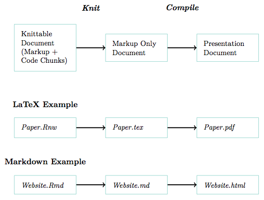
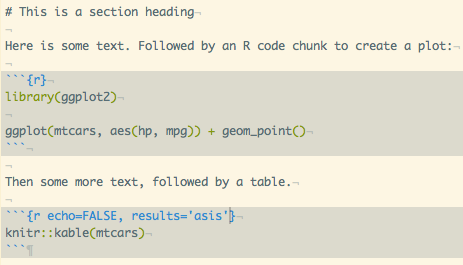
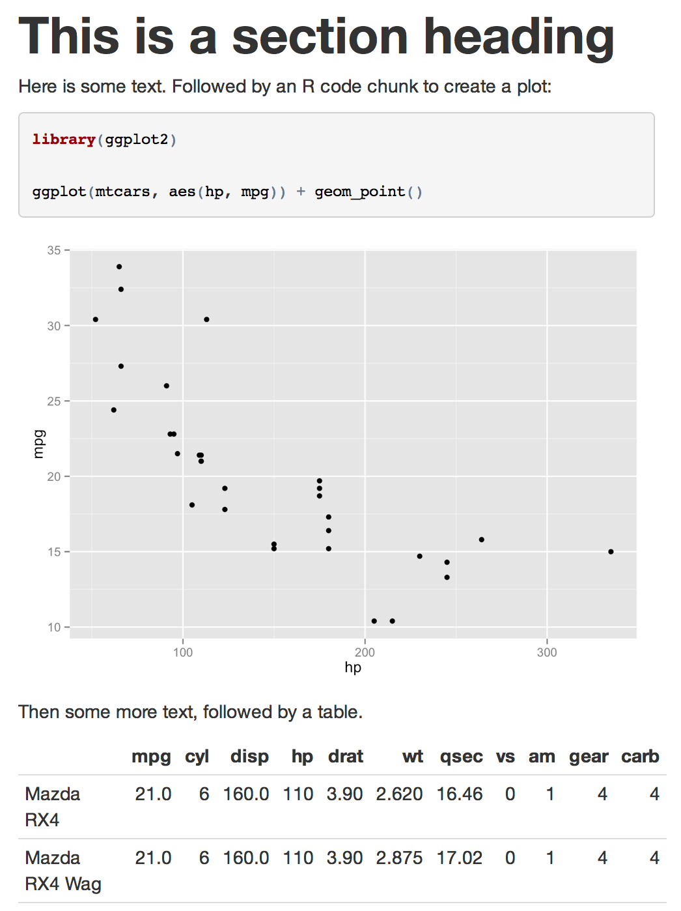
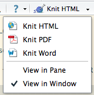
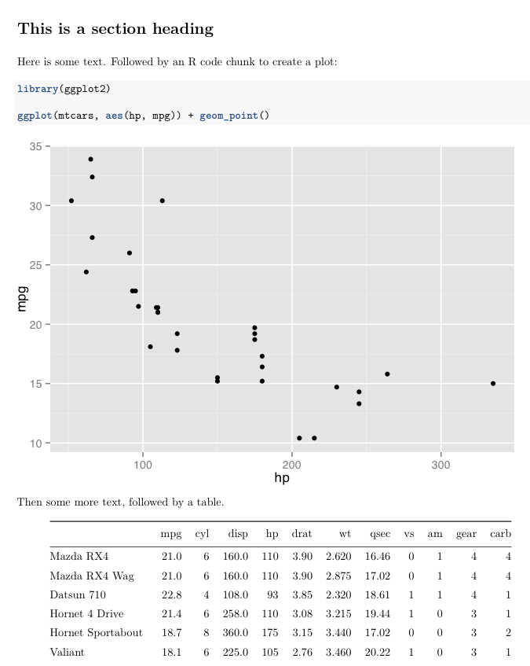
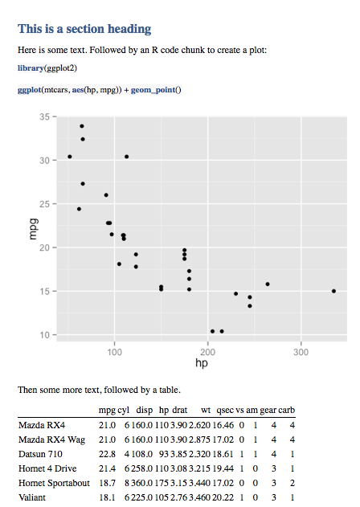
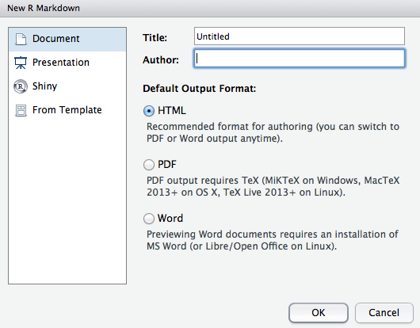

## <i class="fa fa-arrow-circle-o-up"></i> Objectives for the week

- Housecleaning

- **Pair Assignment 2**

- Review

- What is literate programming? Why is it important for reproducible research?

- Introduction to **Markdown**

- Introduction to **R Markdown**.

    + Simple webpages

    + PDF papers

    + Presentations

## <i class="fa fa-exclamation-triangle"></i> Note

<i class="fa fa-frown-o"></i> There is no PDF version of the slides for reasons that will be clear later.

<i class="fa fa-smile-o"></i> Example files are at:

<https://github.com/HertieDataScience/Examples>

## <i class="fa fa-check"></i> Class reschedule

We are rescheduling the classes on 30 October and 13 November.

Please vote at:

- 30 October: <http://doodle.com/batc4xbmrdzqmhy7>

- 13 November: <http://doodle.com/hu9ehmd55zm6bw8v>

**Voting Deadline:** 3 October

## Assignment 1 General Feedback

- **Always test your code!** Does it at least run on your computer as you expect
it to with no errors?

- **Informative** Headers!

- You are free to work across groups, just make sure to use **pull requests** and
**fully document these contributions**.

- Think of the **flow** that you are trying to create when you link your documents
together.

- Initialise repos with R **.gitignore** files.

## Assignment 2

**Proposal** for your Collaborative Research Project.

**Deadline:** Week 6

**Submbit:** A (max) 2,000 word proposal created with **R Markdown**. 

The proposal will:

- State your research question. And justify why it is interesting.

- Provide a basic literature review (properly cited with BibTeX).

- Identify data sources and appropriate research methodologies for answering your
question.

As always, submit the entire GitHub repo.

## Assignment 2

<br>
<br>
<br>

**Definitely see me with your ideas/draft.**

## <i class="fa fa-arrow-left"></i> Review

- In R, what is the difference between a matrix and a data frame?

- What is the assignment operator?

- What is the component selector?

- What two things do you need to describe the distribution of a continuous
variable?

## What is Literate Programming?

[Donald Knuth (1992)](http://en.wikipedia.org/wiki/Literate_programming)
: explanation of a program using **natural language** interspersed
with **code snippets** that are compilable by a computer.

This produces **two representations** of the program:

- A formatted easily human readable document (e.g. a paper).

- Source code that can be compiled by a computer.

## Benefits

**Creates better programs**. Programmers have to explicitly state thoughts and in so
doing find flaws.

**Clear documentation** so that others can understand and build on the program
more easily.

## How literate programming relates to research?

<i class="fa fa-exclamation"></i><i class="fa fa-exclamation"></i>
Quantitative social science **is computer programming**.

You are creating a program that gathers and analyses data.

You then **advertise** this work (a paper) in a way that is completely
understandable to others.

<br>

Added benefit: allows you to **automatically update** documents when there are changes.

## Implementing literate programming

In addition to the computer language, we need:

1. **Natural language part** formatted using a **markup language**.
Markup language: typesetting instructions. E.g. Markdown, $\LaTeX$, HTML.

2. A way to **tangle** or **weave** the **computer language** part into the natural
language part.

## Tangle/Weave for R

In R you can use Yihui Xie's [knitr](http://yihui.name/knitr/) package.

- Language dependent:

    + .Rmd <i class="fa fa-arrow-right"></i> .html (using Markdown)

    + .Rnw <i class="fa fa-arrow-right"></i> .pdf (using $\LaTeX$)

<br>

Note to use knitr in RStudio you need go to **Preferences > Sweave > Weave Rnw
files using: knitr**

## Knitr

Two parts:

- Natural language part written in intended markup language.

- R code (or almost any other language on your system) written in **code chunks**.

## Latex Example



## PDF Output




## The knitr process



## <i class="fa fa-language"></i> Recently

Most of the new focus is on [RStudio's R Markdown](http://rmarkdown.rstudio.com/).

- Directly builds on knitr (Yihui works at RStudio now).

    + Code chunk syntax is almost identical to Markdown in knitr.

- But uses [Pandoc](http://johnmacfarlane.net/pandoc/) to be more **output agnostic**.

    + You can write in (easy) R Markdown and output to **many different formats**.

## Markdown

Originally created by John Gruber to be an easy way to:

- write HTML files 

- that are **human readable as text files**.

## Markdown: HTML less painful

HTML:

```
<h1>A header</h1>

<p>This is some text with a <a href="http://www.example.com">link</a></p>

<p>Here is some <strong>bold</strong> text.</p>
```

Markdown:

```
# A header

This is some text with a [link](http://www.example.com).

Here is some **bold** text.
```

## Markdown syntax: Headers

```
# Header 1

## Header 2

### Header 3
```

And so on.

## Markdown syntax

Horizontal lines:

```
---
```

Bold text:

```
**bold**
```

Italics:

```
*italics*
```

## Markdown syntax

Links:

```
[link](http://www.example.com)
```

Images:

```

```

## Markdown syntax

Unordered Lists:

```
- An item

- An item

- An item
```

Ordered Lists:

```
1. Item one

2. Item two

3. Item three
```

## Tables

```
| Name   | Something |
| ------ | --------- |
| Stuff  | Things    |
| Things | Stuff     |
```

<br>

| Name   | Something |
| ------ | --------- |
| Stuff  | Things    |
| Things | Stuff     |

## Math

R Markdown from RStudio supports [MathJax](http://www.mathjax.org/). So, you can
write any [$\LaTeX$ math](http://en.wikibooks.org/wiki/LaTeX/Mathematics) with 
R Markdown.

```
Inline equations have one dollar sign $s^2 =
\frac{\sum(x - \bar{x})^2}{n - 1}$.
```

**Inline equations** have one dollar sign $s^2 = \frac{\sum(x - \bar{x})^2}{n - 1}$.

**Display equations** have two dollar signs:

```
$$s^2 = \frac{\sum(x - \bar{x})^2}{n - 1}$$
```

$$s^2 = \frac{\sum(x - \bar{x})^2}{n - 1}$$

## Expansion

Note that you can include **any** HTML syntax in a Markdown document.

You can also change the formatting by adding a **custom CSS** file (just like a website).

## Code chunks Inline

To use syntax highlighting on code chunks inline with the text surround your text
with ``

Knitable inline chunks with a back-tick then `r`.

## Code chunks in Display

Use three ticks (```) to **start** and **end** a code chunk that is **not run**.

Create a **knit-able** code chunk begin the chunk with ````{r}`.



## Automatic table generation (basics)

You can turn any matrix or data frame into a well formatted table with the knitr
function `kable`.

```{r, eval=FALSE}
knitr::kable(mtcars)
```

Make sure that the code chunk option `results='asis'`.

## Output Web



## Output PDF or Word

This R Markdown file can be compiled to PDF (via $\LaTeX$) or MS Word with RStudio.



## Output PDF



## Output Word



## Chunk options

Change how R Markdown chunks behave with **options**. Place
options in the chunk head: ````{r echo=FALSE, error=FALSE}`

| Option          | What it Does                                               |
| --------------- | ---------------------------------------------------------- |
| `echo=FALSE`    | Does not print the code only the output                    |
| `error=FALSE`   | Does not print errors                                      |
| `include=FALSE` | Does not include the code or output, but does run the code |
| `fig.width`     | Sets figure width                                          |
| `cache=TRUE`    | Cache the chunk. It is only run when the contents change.  |

Many others at <http://yihui.name/knitr/options>

## RMarkdown Presentations

These lecture slides are created using R Markdown.



## RMarkdown Presentations

All of the syntax is the same, **except**:

`##` Does not mean Header 2. It is creates a **new slide and title**.

You can create a slide with no title using `---`.

## R Markdown Header

The header lets you make changes to the whole document.

This presentation's head is:

```
---
title: 'MPP-E1180 Lecture 4: Intro to Markup Lang. & Literate Programming (1)'
author: "Christopher Gandrud"
date: "1 October 2014"
output:
  ioslides_presentation:
    css: http://maxcdn.bootstrapcdn.com/font-awesome/4.2.0/css/font-awesome.min.css
    logo: https://raw.githubusercontent.com/christophergandrud/Hertie_Collab_Data_Science/master/img/HertieCollaborativeDataLogo_v1.png
  beamer_presentation: default
---
```

We'll look at headers more next week.

## <i class="fa fa-arrow-circle-o-up"></i> Seminar: Create R Markdown Documents

Convert your Pair Assignment 1 to R Markdown and output to multiple formats.

- Add relevant equations.

Create a basic R Markdown presentation.

## <i class="fa fa-arrow-circle-o-up"></i> Seminar: Collaborative Research Project

<br>
<br>

Begin trying to find a partner for the Collaborative Research Project.

Discuss topics you might be interested in researching.
