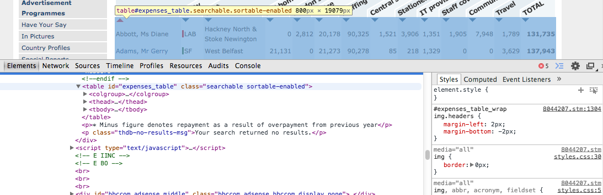

## <i class="fa fa-arrow-circle-o-up"></i> Objectives for the week

- Assignments

- Review

- Intro to web scraping

- Processing strings, including an intro to regular expressions

- Data and data set transformations with dplyr

## Assignment 2

I have marked Assignment 2 and aim to email you the feedback later this week.

Overall, everyone has made a **good first start**.

Minor: checkout these posts on GitHub:

- Problems compiling PDF: 
[SyllabusAndLectures/issues/19](https://github.com/HertieDataScience/SyllabusAndLectures/issues/19)

- Double spacing in R Markdown: 
[SyllabusAndLectures/issues/20](https://github.com/HertieDataScience/SyllabusAndLectures/issues/20)

## Assignment 3

**Purpose**: Gather, clean, and analyse data

**Deadline**: 14 November 2015

You will submit a GitHub repo that:

- Gathers web-based data from at least **two sources**. Cleans and merges the
data so that it is ready for statistical analyses.

- Conducts basic descriptive **and** inferential statistics with the data to 
address a relevant research question.

- Briefly describes the results including with **dynamically** generated tables 
and figures.

- Has a write up of **1,500 words maximum** that describes the data gathering 
and analysis, It also will use literate programming.

## Assignment 3

<br>
<br>
<br>

This is ideally a **good first run** at the data gathering and analysis parts of
your final project.

## Review

What is open public data?

- Name one challenge and one opportunity presented by open public data.

What is a data API?

What are the characteristics of tidy data?

Why are unique observation IDs so important for data cleaning?

## Caveat to Web scraping

I don't expect you to master the tools of web scraping in this course.

I just want you to know that these things are **possible**, so that you 
**know where to look** in future work.

## Web scraping

[Web scraping](http://en.wikipedia.org/wiki/Web_scraping) simply means gathering
data from websites.

Last class we learned a particular form of web scraping: downloading explicitly
structured data files/data APIs.

You can also download information that is not as well structured for statistical
analysis:

- HTML tables

- Text on websites

- Information that requires you to navigate through web forms

To really master web scraping you need a good knowledge of HTML.

## Key tools

The most basic tools for web scraping in R:

- [httr](https://github.com/hadley/httr): gather data + simple parsing

- [XML](http://cran.r-project.org/web/packages/XML/index.html): more advanced
parsing

    + [Parsing](http://en.wikipedia.org/wiki/Parsing): the analysis of HTML
    (and other) markup so that each element is syntactically related in a
    **parse tree**.

Also take a look at [rvest](https://github.com/hadley/rvest). It is a new package
that aims to implement features from Python's popular
[Beautiful Soup](http://www.crummy.com/software/BeautifulSoup/).


## Key steps:

1. **Look at** the HTML for the webpage you want to scrape (use Inspect Element in Chrome).

2. **Request** a URL with `GET`.

3. **Extract** the content from the request with `content`.

    + You can extract either the raw text with `as = 'text'` or parse the content
    with `as = 'parsed'`.

4. **Clean** content (there are many tools for this suited to a variety of
problems).

## Web scraping example

Scrape [BBC's MP's Expenses table](http://news.bbc.co.uk/2/hi/uk_news/politics/8044207.stm).

HTML markup marks tables using `<table>` tags.

We can use these to extract tabular information and convert them into data frames.

In particular, we want the table tag with the id `expenses_table`.

## Viewing the web pages source



## Web scraping example

```{r, message=FALSE}
library(httr)
library(dplyr)
library(XML)

URL <- 'http://news.bbc.co.uk/2/hi/uk_news/politics/8044207.stm'

# Get and parse all tables on the webpage
tables <- URL %>% GET() %>%
            content(as = 'parsed') %>%
            readHTMLTable()

names(tables)
```

## Web scraping example

Now we just need to subset the *tables* list for the `expenses_table` data frame.

```{r}
ExpensesTable <- tables[[5]]

head(ExpensesTable)[, 1:3]
```

## Processing strings

A (frustratingly) large proportion of time web scraping and doing data
cleaning generally is taken up with **processing strings**.

**Key tools** for processing strings:

- knowing your encoding and `iconv` function in base R

- `grep`, `gsub`, and related functions in base R

- Regular expressions

- [stringr](http://journal.r-project.org/archive/2010-2/RJournal_2010-2_Wickham.pdf) package

## Character encoding: Motivation

Sometimes when you load text into R you will get weird symbols like �
([the replacement character](http://en.wikipedia.org/wiki/Specials_(Unicode_block)#Replacement_character))
or other strange things will happen to the text.

NOTE: remember to always check your data when you import it!

This often happens when R is using the **wrong character encoding**.

## Character encoding

All characters in a computer are **encoded** using some standardised system.

R can recognise [latin1](http://en.wikipedia.org/wiki/Latin-1_Supplement_(Unicode_block))
and [UTF-8](http://en.wikipedia.org/wiki/UTF-8).

- latin1 is fairly limited (mostly to the latin alphabet)

- UTF-8 covers a much wider range of characters in many languages

You may need to use the `iconv` function to convert a text to UTF-8 before
trying to process it.

## `grep`, `gsub`, and related functions

<br>
<br>

R (and many programming languages) have functions for **identifying** and
**manipulating** strings.

## Matching

You can use `grep` and `grepl` to find patterns in a vector.

```{r}
pets <- c('cats', 'dogs', 'a big snake')

grep(pattern = 'cat', x = pets)

grepl(pattern = 'cat', pets)

# Subset vector
pets[grep('cats', pets)]
```

## Terminology

<br>
<br>
<br>

grep stands for: **G**lobally search a **R**egular **E**xpression and
**P**rint

## Manipulation

Use `gsub` to substitute strings.

```{r}
gsub(pattern = 'big', replacement = 'small', x = pets)
```

## Regular expressions

[Regular expressions](http://en.wikipedia.org/wiki/Regular_expression) are a
powerful tool for finding and manipulating strings.

They are special characters that can be used to search for text.

For example:

- find characters at only the beginning or end of a string

- find characters that follow or are preceded by a particular character

- find only the first or last occurrence of a character in a string

Many more possibilities.

## Regular expressions examples

Examples modified from [Robin Lovelace](http://www.r-bloggers.com/regular-expressions-in-r-vs-rstudio/).

```{r}
base <- c("cat16_24", "25_34cat", "35_44catch",
          "45_54Cat", "55_4fat$", 'colour', 'color')

## Find only all 'cat' regardles of case
grep('cat', base, ignore.case = T)
```

## Regular expressions examples

```{r}
# Find only 'cat' at the end of the string with $
grep('cat$', base)

# Find only 'cat' at the begining of the string with ^
grep('^cat', base)
```

## Regular expressions examples

```{r}
# Find zero or one of the preceeding character with ?
grep('colou?r', base)

# Find one or more of the preceeding character with +
grep('colou+r', base)

# Find '$' with the escape character \
grep('\\$', base)
```

## Regular expressions examples

```{r}
# Find string with any single character between 'c' and 'l' with .
grep('c.l', base)

# Find a range of numbers with [ - ]
grep('[1-3]', base)

# Find capital letters
grep('[A-Z]', base)
```

## Simple regular expressions cheatsheet

| Character | Use                                       |
| --------- | ----------------------------------------- |
| `$`       | characters at the end of the string       |
| `^`       | characters at the beginning of the string |
| `?`       | zero or one of the preceding character    |
| `*`       | zero or more of the preceding character   |
| `+`       | one or more of the preceding character    |
| `\`       | escape character use to find strings that are expressions |
| `.`       | any single character                      |
| `[ - ]`   | a range of characters                     |

## Simple regular expressions cheatsheet

<br>
<br>
<br>

You can also find the cheat-sheet at: 
[SyllabusAndLectures/Lecture7/README](https://github.com/HertieDataScience/SyllabusAndLectures/blob/master/LectureSlides/Lecture7/README.md)

## String processing with stringer

<br>
<br>
<br>

The stringr package has many helpful functions that make dealing with strings a
bit **easier**.

## stringr examples

Remove leading and trailing **whitespace** (this can be a real problem when creating
consistent variable values):

```{r}
library(stringr)

str_trim(' hello   ')
```

## stringr examples

**Split** strings (really useful for turning 1 variable into 2):

```{r}
trees <- c('Jomon Sugi', 'Huon Pine')

str_split_fixed(trees, pattern = ' ', n = 2)
```

## More data transformations with dplyr

The **dplyr** package has powerful capabilities to manipulate data frames quickly
(many of the functions are written in the
[compiled](http://en.wikipedia.org/wiki/Compiled_language) language
[C++](http://en.wikipedia.org/wiki/C%2B%2B)).

It is also useful for transforming data from **grouped observations**, e.g.
countries, households.

## dplyr

Set up for examples

```{r}
# Create fake grouped data
library(randomNames)
library(dplyr)
library(tidyr)

people <- randomNames(n = 1000)
people <- sort(rep(people, 4))
year <- rep(2010:2013, 1000)
trend_income <- c(30000, 31000, 32000, 33000)
income <-  replicate(trend_income + rnorm(4, sd = 20000),
                     n = 1000) %>%
            data.frame() %>%
            gather(obs, value, X1:X1000)
income$value[income$value < 0] <- 0
data <- data.frame(people, year, income = income$value)
```

## dplyr

```{r}
head(data)
```

## Simple dplyr

Select rows

```{r}
higher_income <- filter(data, income > 60000)

head(higher_income)
```

## Simple dplyr

Select columns

```{r}
people_income <- select(data, people, income)

# OR

people_income <- select(data, -year)

head(people_income)
```

## dplyr with grouped data

Tell dplyr what the groups are in the data with `group_by`.

```{r}
group_data <- group_by(data, people)
head(group_data)[1:5, ]
```

Note: all of the following functions work on **non-grouped data** as well.

## dplyr with grouped data

Now that we have declared the data as grouped, we can do operations on each group.

For example, we can extract the highest and lowest income years for each person:

```{r}
min_max_income <- summarize(group_data,
                            min_income = min(income),
                            max_income = max(income))
head(min_max_income)[1:3, ]
```

## dplyr with grouped data

We can sort the data using `arrange`.

```{r}
# Sort highest income for each person in ascending order
ascending <- arrange(min_max_income, max_income)
head(ascending)[1:3, ]
```

## dplyr with grouped data

Add `desc` to sort in descending order

```{r}
descending <- arrange(min_max_income, desc(max_income))
head(descending)[1:3, ]
```

## dplyr with grouped data

`summarize` creates a new data frame with the summarised data.

We can use `mutate` to add new columns to the original data frame.

```{r}
data <- mutate(group_data,
                min_income = min(income),
                max_income = max(income))
head(data)[1:3, ]
```

## <i class="fa fa-arrow-circle-o-up"></i> Seminar: Web scraping and data transformations

**Scrape** and **clean** the Medal Table from
<http://www.bbc.com/sport/winter-olympics/2014/medals/countries>.

- Also, sort by total medals in **descending order**.

<br>

Work on **gathering data and cleaning** for **Assignment 3**.
