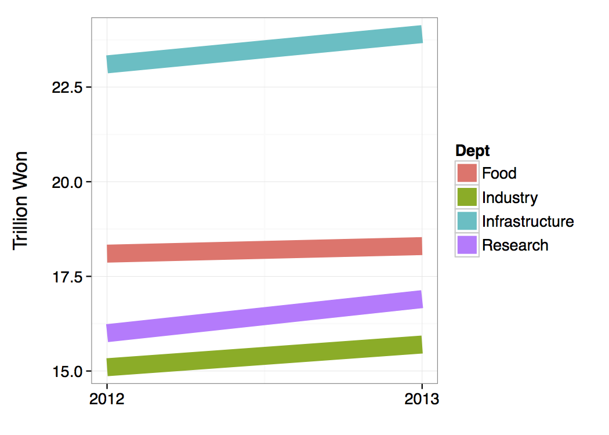
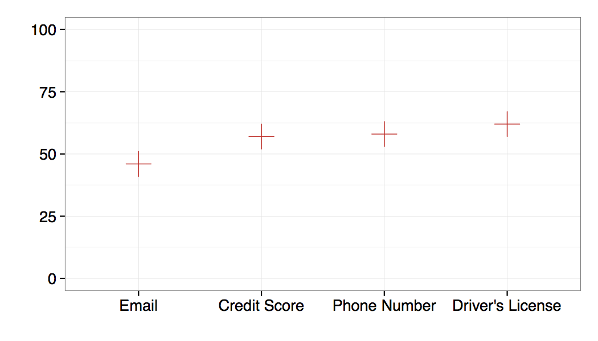

## <i class="fa fa-arrow-circle-o-up"></i> Objectives for the week

- Assignment 3

- Review

- Static results presentation

    + Automatic table creation

    + Plotting best practices

    + ggplot2 for general graphing

    + Zelig simulations for showing results


## Assignment 3

**Purpose**: Gather, clean, and analyse data

**Deadline**: 14 November 2015

You will submit a GitHub repo that:

- Gathers web-based data from at least **two sources**. Cleans and merges the
data so that it is ready for statistical analyses.

- Conducts basic descriptive and inferential statistics with the data to address
a relevant research question.

- Briefly describes the results including with dynamically generated tables and
figures.

- Has a write up of 1,500 words maximum that describes the data gathering and
analysis and uses literate programming.

## Assignment 3

<br>
<br>
<br>

<i class="fa fa-exclamation"></i><i class="fa fa-exclamation"></i><i class="fa fa-exclamation"></i>
**Note**: I will be traveling/at a conference/not able to check my email much
on the **13th** and **14th**.

So try to ask all of your **questions by the 12th (Wednesday)**.

I will have **normal office hours** on Wednesday.

## Review

- What is the basic R syntax for a regression model?

- What is a model function?

- How do you find a confidence interval for a parameter point estimate (both
    mathematically and in R)?

- What is a good way to interpret and present results from a logistic
regression?

## Motivation

Today we will learn how to **communicate your research findings** with
automatically generated tables and static plots.

Why automatically generate?

- **Saves time**: don't have to re-enter numbers by hand into a table or
restyle a graph.

- Easier to **find and correct errors**: all source code that created
all tables and figures  is linked and output updated when corrections are made.

- **More reproducible**: everything is clearly linked together.

## General process

In general include the functions to create the tables/figures in a code chunk.

Include in the **code chunk head** `echo=FALSE, warning=FALSE, error=FALSE,
message=FALSE`.

You may need to also include `results='asis` for some table functions.

See previous weeks 4 and 5 for figure code chunk options.

## Automatic table generation

There are a number of tools for automatically generating tables in R/R Markdown.

- `kable` in the knitr package

- [xtable](http://cran.r-project.org/web/packages/xtable/vignettes/xtableGallery.pdf)
package

- [texreg](http://www.jstatsoft.org/v55/i08/paper) package

- [stargazer](http://cran.r-project.org/web/packages/stargazer/stargazer.pdf)
package

## Today

We will focus on `kable` and `texreg`.

- `kable` is a good, **simple** tool for creating tables from **data frames** (or
matrices).

- `texreg` is useful for creating more complex tables with **regression model
output**.

## `kable` example: predicted probabilities

Set up from Lecture 8:

```{r}
# Load data
URL <- 'http://www.ats.ucla.edu/stat/data/binary.csv'
Admission <- read.csv(URL)

# Estimate model
Logit1 <- glm(admit ~ gre + gpa + as.factor(rank),
              data = Admission, family = 'binomial')

# Create fitted data
fitted <- with(Admission,
               data.frame(gre = mean(gre),
                          gpa = mean(gpa),
                          rank = factor(1:4)))
```

## `kable` example: predicted probabilities

```{r}
library(knitr)
fitted$predicted <- predict(Logit1, newdata = fitted,
                            type = 'response')
kable(fitted)
```

## `kable` example: predicted probabilities

You can stylise the table.

```{r}
kable(fitted, align = 'c', digits = 2,
      caption = 'Predicted Probabilities for Fitted Values')
```

## Show regression output with `texreg`

`kable` is limited if we want to create regression output tables, especially for
multiple models.

`texreg is good for this.

## `texreg` example

Estimate models

```{r}
L1 <- glm(admit ~ gre,
              data = Admission, family = 'binomial')

L2 <- glm(admit ~ gre + gpa,
              data = Admission, family = 'binomial')

L3 <- glm(admit ~ gre + gpa + as.factor(rank),
              data = Admission, family = 'binomial')
```

## `texreg` example

```{r, message=FALSE, echo=FALSE, results='asis'}
library(texreg)
htmlreg(list(L1, L2, L3), body.tag=F, head.tag=F, html.tag=F, doctype=F, inline.css=T)
```

## Showing Results with Figures

<br>
<br>

Tables are **are important** to include so that readers can **explore
details**, but are **usually not the best way** to show your results.

**Figures** are often more effective.

## General principles

(A Selection of) Tufte's Principles for Excellent Statistical Graphics
[-@Tufte2001, 13]:

- Show the data

- Encourage the eye to compare **differences** in the data

- Serve a clear purpose

- Avoid distorting the data

- Be closely integrated with the text

## Show the data

Show the data, not other things like silly graphics or unnecessary words.

Have a high **data ink** ratio.

$$
\mathrm{Data\:Ink\:Ratio} = \mathrm{\frac{data - ink}{total\:ink}}
$$

## Encourage the eye to compare differences

How did the budgets change? (Orange is 2013, Blue is 2012)


## A little better



## Even better


## Avoid distorting the data: special case circles

In general: Avoid using the **size** of a circle to mean something!

So, avoid:

- bubble charts

- pie charts

## Why avoid circles?

Circles can distort data.

- It is difficult to compare their size.

- The Ebbinghause Illusion!

---

Order the circles from smallest to largest.

The circles are on a scale of 0-100, so what are their values?


---

Order the circles from smallest to largest.

The circles are on a scale of 0-100, so what are their values?



## Ebbinghause Illusion

Which circle is bigger?


## Colours and Data Distortions

Which square is darkest?


## Colour Principles

<br>
<br>
<br>

**Only** give give graphical features (e.g. bars in a bar chart) different
colours if it **means something** in the data.


## Colour Principles

Colours should be used to:

- highlight particular data,

- group items,

- encode quantitative values.

## Bad


## Good


## Colours and accessibility

**Color Blindness**

People who are colour blind can have difficulty distinguishing between
**red-green** and **blue-yellow**.

About 5-8% of men are colour blind.

We need to choose colour schemes for our graphics that are colour
blind friendly.

For more information see <http://www.usability.gov/get-involved/blog/2010/02/color-blindness.html>.

## A more systematic introduction to ggplot2

<br>
<br>
<br>

"gg" means "Grammar of Graphics". "2" just means that it is the second one.

## ggplot2 syntax

Each plot is made of **layers**. Layers include the coordinate system (x-y), points,
labels, etc.

Each layer has **aesthetics** (aes) including the x & y, size, shape, and colour.

The **main layer types** are called **geometrics** (geom). These include
lines, points, density plots, bars, and text.

## ggplot2 examples setup

```{r, message=FALSE}
library(devtools)
library(ggplot2)

source_url("http://bit.ly/OTWEGS")

# Create data with no missing values of infant mortali
InfantNoMiss <- subset(MortalityGDP,
                           !is.na(InfantMortality))

# Create High/Low Income Variable
InfantNoMiss$DumMort[InfantNoMiss$InfantMortality
                     >= 15] <- "high"
InfantNoMiss$DumMort[InfantNoMiss$InfantMortality
                     < 15] <- "low"
```

## Simple example

```{r, warning=FALSE}
ggplot(data = MortalityGDP, aes(x = InfantMortality,
        y = GDPperCapita)) + geom_point()
```

## Simple example with BW theme

```{r warning=FALSE}
ggplot(data = MortalityGDP, aes(x = InfantMortality,
        y = GDPperCapita)) + geom_point() + theme_bw(base_size = 13)
```

## Colours

<br>
<br>

There are a number of ways to specify colours in ggplot2.

The simplest way is to let ggplot choose the colours for you.

---

```{r warning=FALSE}
ggplot(data = InfantNoMiss, aes(log(InfantMortality),
                                log(GDPperCapita))) +
      geom_point(aes(colour = income)) +
      theme_bw()
```

## Selecting colours

There are many ways to pick specific colors.

In this class we will mainly use **hexadecimal** colours.

This is probably the most commonly used system for choosing
colours on the web.

Every colour is given six digits.

A good website for getting hexadecimal colour schemes is:
<http://colorbrewer2.org/>.

---

```{r eval=FALSE}
# Create colour vector
Colours <- c("#1B9E77", "#D95F02", "#7570B3",
             "#E7298A", "#66A61E", "#E6AB02")

# Create graph
ggplot(data = InfantNoMiss,
                    aes(log(InfantMortality),
                        log(GDPperCapita))) +
        geom_point(aes(colour = income)) +
        scale_color_manual(values = Colours) +
        xlab("\nLog Infant Mortality") +
        ylab("Log GDP/Capita\n") +
        ggtitle("Log Transformed Data\n") +
        theme_bw()
```

---

```{r message=FALSE, echo=FALSE, warning=FALSE}
# Create colour vector
Colours <- c("#1B9E77", "#D95F02", "#7570B3",
             "#E7298A", "#66A61E", "#E6AB02")
# Create graph
ggplot(data = InfantNoMiss,
                    aes(log(InfantMortality),
                        log(GDPperCapita))) +
        geom_point(aes(colour = income)) +
        scale_color_manual(values = Colours) +
        xlab("\nLog Infant Mortality") +
        ylab("Log GDP/Capita\n") +
        ggtitle("Log Transformed Data\n") +
        theme_bw()
```

## ggplot2 is very flexible

```{r eval=FALSE}
# Create a violin Plot
ggplot(InfantNoMiss, aes(factor(DumMort),
                        log(GDPperCapita))) +
          geom_violin(fill = "#E7298A",
                      colour = "#E7298A",
                      alpha = I(0.5)) +
          geom_jitter(color = "#7570B3") +
          xlab("\n Infant Mortality") +
          ylab("Log GDP Per Capital\n") +
          theme_bw(base_size = 16)
```

---

```{r message=FALSE, echo=FALSE, warning=FALSE}
# Create a violin Plot
ggplot(InfantNoMiss, aes(factor(DumMort),
                        log(GDPperCapita))) +
          geom_violin(fill = "#E7298A",
                      colour = "#E7298A",
                      alpha = I(0.5)) +
          geom_jitter(color = "#7570B3") +
          xlab("\n Infant Mortality") +
          ylab("Log GDP Per Capital\n") +
          theme_bw(base_size = 16)
```

## Showing results from regression models

<br>
<br>
<br>

@King2001 argue that **post estimation simulations** can be used to
effectively communicate **results from regression models**.

## Steps

1. Estimate our parameters' point estimates for $\hat{\beta}_{1\ldots k}$.

2. Draw $n$ values of the point estimates from multivariate normal distributions
with means $\bar{\beta}_{1\ldots k}$ and variances specified by the parameters'
estimated co-variance.

3. Use the simulated values to calculate quantities of interest (e.g. predicted
probabilities).

4. Plot the results.

## Notes

Post-estimation simulations allow us to effectively communicate our estimates
and the **uncertainty around them**.

This method is broadly similar to a fully Bayesian approach with Markov-Chain
Monte Carlo or bootstrapping. Just differ on **how the parameters are
drawn**.

## Implementation

It is relatively easy find the coefficient estimates from an estimated
model with `coef`.

You can find the co-variance matrix with `vcov`.

Then draw the values from the multivariate normal distribution with `mvrnorm`.

Finally, calculate the quantity of interest with the draws + fitted values using
and plot the results.

## Easier Implementation

<br>
<br>
<br>

The [Zelig](http://gking.harvard.edu/zelig) package streamlines this process.

## Zelig (1)

First estimate your regression model using `zelig`.

```{r, message=FALSE}
library(Zelig)

# Have to explicitly declare rank as factor
Admission$rank <- as.factor(Admission$rank)

Z1 <- zelig(admit ~ gre + gpa + rank, cite = FALSE,
              data = Admission, model = 'logit')
```

## Zelig (2)

Then set the fitted values with `setx`.

```{r}
setZ1 <- setx(Z1, gre = seq(220, 800, by = 1))
```

And run the simulations (1,000 by default) with `sim`.

```{r}
simZ1 <- sim(Z1, x = setZ1)
```

## Zelig (3)

Plot:

```{r}
plot(simZ1)
```

## Seminar

<br>
<br>
<br>

Create descriptive and inferential visualisations for your Assignment 3
using the techniques covered in class today.

## References
