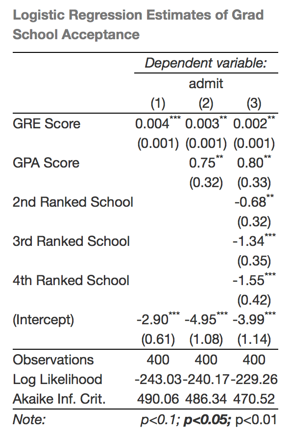
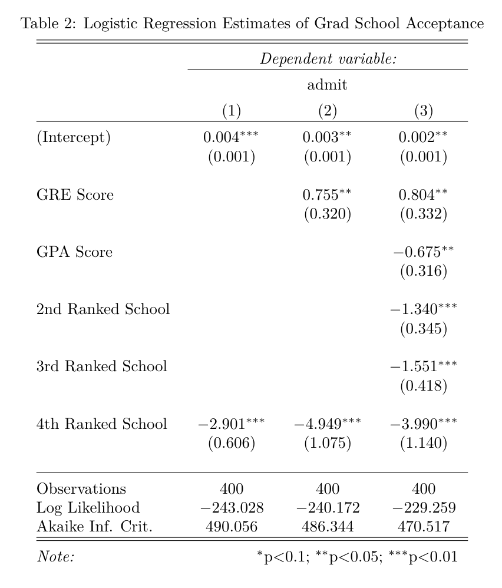

## <i class="fa fa-arrow-circle-o-up"></i> Objectives for the week

- Assignment 3/Final Project

- Review

- Static results presentation

    + Automatic table creation

    + Plotting best practices

    + ggplot2 for general graphing

    + Simulations for showing results

## Assignment 3

**Purpose**: Gather, clean, and analyse data

**Deadline**: 15 April 2016 (note change!)

You will submit a GitHub repo that:

- Gathers web-based data from at least **two sources**. Cleans and merges the
data so that it is ready for statistical analyses.

- Conducts basic descriptive and inferential statistics with the data to address
a relevant research question.

- Briefly describes the results including with dynamically generated tables and
figures.

- Has a write up of 1,500 words maximum that describes the data gathering and
analysis and uses literate programming.

## Collaborative Research Project (1)

**Purposes**: Pose an interesting research question and try to answer it using
data analysis and standard academic practices. Effectively communicate your
results to a **variety of audiences** in a **variety of formats**.

**Deadline**:

- Presentation: In-class Monday 2 May

- Website/Paper: 13 May 2016

## Collaborative Research Project (2)

The project can be thought of as a 'dry run' for your thesis with multiple 
presentation outputs.

Presentation: 10 minutes **maximum**. **Engagingly** present your research
question and key findings to a general academic audience (fellow students).

Paper: 5,000 words maximum. **Standard academic paper**, properly cited laying out
your research question, literature review, data, methods, and findings.

Website: An engaging website designed to convey your research to **a general
audience**.

## Collaborative Research Project (3)

As always, you should **submit one GitHub repository** with all of the
materials needed to **completely reproduce** your data gathering, analysis, and
presentation documents.

**Note**: Because you've had two assignments already to work on parts of the
project, I expect **high quality work**.

## Collaborative Research Project (3)

Find one other group to be a **discussant** for your presentation.

The discussants will provide a quick (max 2 minute) critique of your 
presentation--ideas for things you can improve on your paper.

## Office hours

I will have normal office hours every week for the rest of the term 
**except 4 April**.

Please take advantages of this opportunity to **improve your final project**.


## Review

- What is the basic R syntax for a regression model?

- What is a model function? What two parts do GLM model functions have?

- How do you find a 95% confidence interval for a parameter point estimate (both
    mathematically and in R)?

- What is one good way to interpret and present results from a logistic
regression to both a statistical and general audience?

## Motivation

Today we will learn how to **communicate your research findings** with
automatically generated tables and static plots.

Why automatically generate?

- **Saves time**: don't have to re-enter numbers by hand into a table or
restyle a graph each time you change the data/analysis.

- Easier to **find and correct errors**: all source code that created
all tables and figures  is linked and output updated when corrections are made.

- **More reproducible**: everything is clearly linked together.

## General process

In general include the functions to create the tables/figures in a code chunk.

Include in the **code chunk head** `echo=FALSE, warning=FALSE, error=FALSE,
message=FALSE`.

You may need to also include `results='asis'` for some table functions.

See previous weeks 4 and 5 for figure code chunk options.

## Automatic table generation

There are a number of tools for automatically generating tables in R/R Markdown.

- `kable` in the knitr package

- [xtable](http://cran.r-project.org/web/packages/xtable/vignettes/xtableGallery.pdf)
package

- [texreg](http://www.jstatsoft.org/v55/i08/paper) package

- [stargazer](http://cran.r-project.org/web/packages/stargazer/stargazer.pdf)
package

```{r include=FALSE}
library(stargazer)
```

## Today

We will focus on `kable` and `stargazer`.

- `kable` is a good, **simple** tool for creating tables from **data frames** (or
matrices).

- `stargazer` is useful for creating more complex tables of **regression model
output**.

**Example Docs**:
[HertieDataScience/Examples/PaperWithRegressionTables](https://github.com/HertieDataScience/Examples/tree/master/PaperWithRegressionTables)

## `kable` example: predicted probabilities

Set up from Lecture 8:

```{r}
# Load data
URL <- 'http://www.ats.ucla.edu/stat/data/binary.csv'
Admission <- read.csv(URL)

# Estimate model
Logit1 <- glm(admit ~ gre + gpa + as.factor(rank),
              data = Admission, family = 'binomial')

# Create fitted data
fitted <- with(Admission,
               data.frame(gre = mean(gre),
                          gpa = mean(gpa),
                          rank = factor(1:4)))
```

## `kable` example: predicted probabilities

```{r}
library(knitr)
fitted$predicted <- predict(Logit1, newdata = fitted,
                            type = 'response')
kable(fitted)
```

## `kable` example: predicted probabilities

You can stylise the table.

```{r}
kable(fitted, align = 'c', digits = 2,
      caption = 'Predicted Probabilities for Fitted Values')
```

## Note

**Don't** showing more digits to the right of the decimal than are statistically
and substantively meaningful.

**A rule of thumb**: more than one or two digits are rarely meaningful.

See also: <http://andrewgelman.com/2012/07/02/moving-beyond-hopeless-graphics/>

## Show regression output with `stargazer`

`kable` is limited if we want to create regression output tables, especially for
multiple models.

`stargazer` is good for this.

## `stargazer` example

Estimate models

```{r}
L1 <- glm(admit ~ gre,
              data = Admission, family = 'binomial')

L2 <- glm(admit ~ gre + gpa,
              data = Admission, family = 'binomial')

L3 <- glm(admit ~ gre + gpa + as.factor(rank),
              data = Admission, family = 'binomial')
```

## `stargazer` example HTML

When you are creating a table for an HTML doc with stargazer use:

- `type = 'html'`

```{r, eval=FALSE}
# Create cleaner covariate labels
labels <- c('GRE Score', 'GPA Score',
            '2nd Ranked School', '3rd Ranked School',
            '4th Ranked School', '(Intercept)')

stargazer::stargazer(L1, L2, L3, covariate.labels = labels,
    title = 'Logistic Regression Estimates of Grad School Acceptance',
    digits = 2, type = 'html')
```

## `stargazer` example HTML



## `stargazer` example PDF

**When you are creating a PDF** use the arguments:

- `type = 'latex'`

- `header = FALSE`

```{r, eval=FALSE}
# Create cleaner covariate labels
labels <- c('GRE Score', 'GPA Score',
            '2nd Ranked School', '3rd Ranked School',
            '4th Ranked School', '(Intercept)')

stargazer::stargazer(L1, L2, L3, covariate.labels = labels,
    title = 'Logistic Regression Estimates of Grad School Acceptance',
    digits = 2, type = 'latex', header = FALSE)
```

## `stargazer` output in PDF



## `stargazer` plain text output 

You may want to compare multiple models at once in your R console, use `stargazer`
with `type = 'text'`:

```{r eval=FALSE}
stargazer(L1, L2, L3, type = 'text')
```

## Showing Results with Figures

<br>
<br>

Tables **are important** to include so that readers can **explore
details**, but are **usually not the best way** to show your results.

**Figures** are often more effective.

## General principles

(A Selection of) Tufte's Principles for Excellent Statistical Graphics
[-@Tufte2001, 13]:

- Show the data

- Encourage the eye to compare **differences** in the data

- Serve a clear purpose

- Avoid distorting the data

- Be closely integrated with the text

## Show the data

Show the data, not other things like silly graphics or unnecessary words.

Have a high **data ink** ratio:

$$
\mathrm{Data\:Ink\:Ratio} = \mathrm{\frac{data - ink}{total\:ink}}
$$

## Encourage the eye to compare differences

How did the budgets change? (Orange is 2013, Blue is 2012)


## A little better


## Even better


## Avoid distorting the data: special case circles

In general: Avoid using the **size** of a circle to mean something!

So, avoid:

- bubble charts

- pie charts

## Why avoid circles?

Circles can distort data.

- It is difficult to compare their size.

- The Ebbinghause Illusion!

---

Order the circles from smallest to largest.

The circles are on a scale of 0-100, so what are their values?


---


## Ebbinghause Illusion

Which circle is bigger?


## Colours and Data Distortions

Which square is darkest?


## Colour Principles

<br>
<br>
<br>

**Only** give graphical features (e.g. bars in a bar chart) different
colours if it **means something** in the data.


## Colour Principles

Colours should be used to:

- highlight particular data,

- group items,

- encode quantitative values

    + Values of continuous variables should be represented using **increasing
    hues of the same colour**.

    + Categorical variables should be represented with **different colours**.
    (rule of thumb: avoid using more than about 7 colours in a plot)

## Bad


## Good


## Colours and accessibility

**Color Blindness**

People who are colour blind can have difficulty distinguishing between
**red-green** and **blue-yellow**.

About 5-8% of men are colour blind.

We need to choose colour schemes for our graphics that are **colour
blind friendly**.

For more information see <http://www.usability.gov/get-involved/blog/2010/02/color-blindness.html>.

## Selecting colors

<br>
<br>

Color Brewer is a great resource for selecting colours:
<http://colorbrewer2.org/>.

## A more systematic introduction to ggplot2

<br>
<br>
<br>

"gg" means "Grammar of Graphics".

"2" just means that it is the second one.

## ggplot2 syntax

Each plot is made of **layers**. Layers include the coordinate system (x-y), points,
labels, etc.

Each layer has **aesthetics** (`aes`) including the x & y, size, shape, and colour.

The **main layer types** are called **geometrics** (`geom`). These include
lines, points, density plots, bars, and text.

## ggplot2 examples setup

```{r, message=FALSE, warning=FALSE}
library(devtools)
library(ggplot2)

source_url("http://bit.ly/OTWEGS")

# Create data with no missing values of infant mortality
InfantNoMiss <- subset(MortalityGDP,
                           !is.na(InfantMortality))

# Create High/Low Income Variable
InfantNoMiss$DumMort[InfantNoMiss$InfantMortality
                     >= 15] <- "high"
InfantNoMiss$DumMort[InfantNoMiss$InfantMortality
                     < 15] <- "low"
```

## Simple example

```{r, warning=FALSE}
ggplot(data = MortalityGDP, aes(x = InfantMortality,
        y = GDPperCapita)) + geom_point()
```

## Simple example with BW theme

```{r warning=FALSE}
ggplot(data = MortalityGDP, aes(x = InfantMortality,
        y = GDPperCapita)) + geom_point() + theme_bw(base_size = 13)
```

## Colours

<br>
<br>

There are a number of ways to specify colours in ggplot2.

The simplest way is to let ggplot choose the colours for you.

---

```{r warning=FALSE}
ggplot(data = InfantNoMiss, aes(log(InfantMortality),
                                log(GDPperCapita))) +
      geom_point(aes(colour = income)) +
      theme_bw()
```

## Selecting colours

There are many ways to pick specific colors.

In this class we will mainly use **hexadecimal** colours.

This is probably the most commonly used system for choosing
colours on the web.

Every colour is given six digits.

A good website for getting hexadecimal colour schemes is:
<http://colorbrewer2.org/>.

---

```{r eval=FALSE}
# Create colour vector
Colours <- c("#1B9E77", "#D95F02", "#7570B3",
             "#E7298A", "#66A61E", "#E6AB02")

# Create graph
ggplot(data = InfantNoMiss,
                    aes(log(InfantMortality),
                        log(GDPperCapita))) +
        geom_point(aes(colour = income)) +
        scale_color_manual(values = Colours) +
        xlab("\nLog Infant Mortality") +
        ylab("Log GDP/Capita\n") +
        ggtitle("Log Transformed Data\n") +
        theme_bw()
```

---

```{r message=FALSE, echo=FALSE, warning=FALSE}
# Create colour vector
Colours <- c("#1B9E77", "#D95F02", "#7570B3",
             "#E7298A", "#66A61E", "#E6AB02")
# Create graph
ggplot(data = InfantNoMiss,
                    aes(log(InfantMortality),
                        log(GDPperCapita))) +
        geom_point(aes(colour = income)) +
        scale_color_manual(values = Colours) +
        xlab("\nLog Infant Mortality") +
        ylab("Log GDP/Capita\n") +
        ggtitle("Log Transformed Data\n") +
        theme_bw()
```

## ggplot2 is very flexible

```{r eval=FALSE}
# Create a violin Plot
ggplot(InfantNoMiss, aes(factor(DumMort),
                        log(GDPperCapita))) +
          geom_violin(fill = "#E7298A",
                      colour = "#E7298A",
                      alpha = I(0.5)) +
          geom_jitter(color = "#7570B3") +
          xlab("\n Infant Mortality") +
          ylab("Log GDP Per Capital\n") +
          theme_bw(base_size = 16)
```

---

```{r message=FALSE, echo=FALSE, warning=FALSE}
# Create a violin Plot
ggplot(InfantNoMiss, aes(factor(DumMort),
                        log(GDPperCapita))) +
          geom_violin(fill = "#E7298A",
                      colour = "#E7298A",
                      alpha = I(0.5)) +
          geom_jitter(color = "#7570B3") +
          xlab("\n Infant Mortality") +
          ylab("Log GDP Per Capital\n") +
          theme_bw(base_size = 16)
```

## Showing results from regression models

<br>
<br>
<br>

@King2001 argue that **post-estimation simulations** can be used to
effectively communicate **results from regression models**.

## Steps

1. Estimate our parameters' point estimates for $\hat{\beta}_{1\ldots k}$.

2. Draw $n$ values of the point estimates from multivariate normal distributions
with means $\bar{\beta}_{1\ldots k}$ and variances specified by the parameters'
estimated co-variance.

3. Use the simulated values to calculate quantities of interest (e.g. predicted
probabilities).

4. Plot the simulated distribution using **visual weighting**.

## Notes

Post-estimation simulations allow us to effectively communicate our estimates
and the **uncertainty around them**.

This method is broadly similar to a fully Bayesian approach with Markov-Chain
Monte Carlo or bootstrapping. Just differ on **how the parameters are
drawn**.

## Implementation

1. Find the coefficient estimates from an estimated model with `coef`.

2. Find the co-variance matrix with `vcov`.

3. Draw point estimates from the multivariate normal distribution with `mvrnorm`.

4. Calculate the quantity of interest with the draws + fitted values using
and plot the results.

## Simulations: estimate model

First estimate your model as normal and create fitted values:

```{r}
library(car) # Contains data
M_prest <- lm(prestige ~ education + type, 
         data = Prestige)

# Find a range of education values
range(Prestige$education)

edu_range <- 6:16
```

## Simulations: extract estimates

Extract point estimates (coefficients) and co-variance matrix:

```{r}
mp_coef <- matrix(coef(M_prest))
mp_vcov <- vcov(M_prest)
```

Now draw 1,000 simulations of your point estimates:

```{r message=FALSE}
library(MASS) # contains the mvrnorm function
drawn <- mvrnorm(n = 1000, mu = mp_coef, Sigma = mp_vcov) %>% 
            data.frame
head(drawn)[1:3, ]
```

## Simulations: merge in fitted values

Now we can add in our fitted values to the simulation data frame:

```{r}
drawn_sim <- merge(drawn, edu_range)

# Rename the fitted value variable
drawn_sim <- dplyr::rename(drawn_sim, fitted_edu = y)

nrow(drawn)
nrow(drawn_sim)
```


## Simulations: calculate quantity of interest

Using the normal linear regression formula ($\hat{y_{i}} = \hat{\alpha} + X_{i1}\hat{\beta_{1}} + \ldots$) 
we can find the quantity of interest for white collar workers:

```{r}
names(drawn_sim)
drawn_sim$sim_wc <- drawn_sim[, 1] + drawn_sim[, 2] * drawn_sim[, 5] + 
                        drawn_sim[, 3]
```


## Simulations: plot points

```{r}
ggplot(drawn_sim, aes(fitted_edu, sim_wc)) + 
        geom_point(alpha = 0.2) + stat_smooth(se = FALSE) +
        theme_bw()

```

## Simulations: find 95% central interval ribbons

```{r}
# Find 95% central interval and median at each fitted value of edu
central <- drawn_sim %>% group_by(fitted_edu) %>%
            summarise(median_sim = median(sim_wc),
                      lower_95 = quantile(sim_wc, probs = 0.025),
                      upper_95 = quantile(sim_wc, probs = 0.975)
            )
```

## Simulations: plot 95% central interval

```{r}
ggplot(central, aes(fitted_edu, median_sim)) +
    geom_ribbon(aes(ymin = lower_95, ymax = upper_95), alpha = 0.3) +
    geom_line() + theme_bw()
```

## Predictions from logistic regression

Use the same steps for simulating predicted outcomes from logistic regression models.
The only difference is that the equation for the quantity of interest is:

$$
P(y_{i} = 1) = \frac{\mathrm{exp}(\hat{\alpha} + X_{i1}\hat{\beta_{1}} + \ldots)}{1 - \mathrm{exp}(\hat{\alpha} + X_{i1}\hat{\beta_{1}} + \ldots)}
$$

## Easier Implementation (1)

<br>
<br>
<br>

Last week I started working on the [simGLM](https://github.com/christophergandrud/simGLM) package for doing this process with normal linear and logistic regression models. 

## simGLM

```{r, message=FALSE}
fitted_edu <- expand.grid(education = edu_range, typeprof = 1)
simGLM::sim_glm(M_prest, newdata = fitted_edu, x_coef = 'education')
```

## simGLM

**simGLM** is in development. Comments, bug reports welcome!

It can be downloaded with:

```{r eval=FALSE}
ghit::install_github('christophergandrud/simGLM')
```

For more examples see: <http://bit.ly/22oSUHW>

## Easier Implementation (2)

<br>
<br>
<br>

The [Zelig](http://gking.harvard.edu/zelig) package also streamlines the simulation process.

## Zelig (1)

First estimate your regression model using `zelig`.

```{r, message=FALSE}
library(Zelig)

# Have to explicitly declare rank as factor
Admission$rank <- as.factor(Admission$rank)

Z1 <- zelig(admit ~ gre + gpa + rank, cite = FALSE,
              data = Admission, model = 'logit')
```

## Zelig (2)

Then set the fitted values with `setx`.

```{r}
setZ1 <- setx(Z1, gre = 220:800)
```

And run the simulations (1,000 by default) with `sim`.

```{r}
simZ1 <- sim(Z1, x = setZ1)
```

## Zelig (3)

Plot:

```{r}
ci.plot(simZ1)
```

## Seminar

<br>
<br>
<br>

Create **tables** and **visualisations** of **descriptive** and **inferential** 
for your Assignment 3 in an R Markdown document using the techniques covered in 
class today.

If you don't have your data set fully cleaned yet, use one of the built-in
R data sets for practice.

**Bonus** help develop [simGLM](https://github.com/christophergandrud/simGLM). 
Test out the examples on the README, suggest other model types to simulate 
quantities of interest for, and more.

## References
