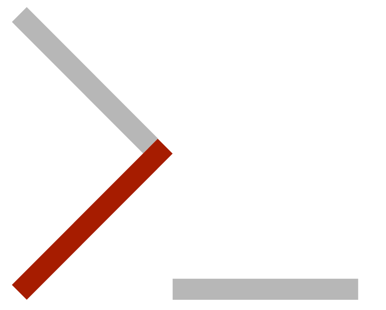

# MPP-E1180: Introduction to Collaborative Social Science Data Analysis

### Spring 2016

**Version: 15 January 2016**

### Instructor: Christopher Gandrud

- Office: 1.64

- Email: <a href="mailto:gandrud@hertie-school.org">gandrud@hertie-school.org</a>

- Website: <a href="http://christophergandrud.blogspot.com/">http://christophergandrud.blogspot.com/</a>

- Work: <a href="https://github.com/christophergandrud">https://github.com/christophergandrud</a>

The objective of this course is to **learn how to collaboratively and reproducibly gather social data, analyse it, and effectively present results**.

**The course is intended to be immediately useful for your academic work, as well as work in the public and private sectors**. The tools you learn and the final project you complete in this course will be directly useful for your **thesis research**. As increasing emphasis in **academics** is being placed on the skills needed to effectively gather, handle, and analyse data as well as present results to a range of audiences in highly reproducible ways, this course will provide you with important tools for future academic study. **Governments** and international institutions are increasingly adopting the technologies and methods of collaborative open data science. For examples, see initiatives by the [World Bank](http://blogs.worldbank.org/opendata/open-data-community-grows-together-stays-together), [Germany](https://www.govdata.de/neues), [New York City](https://nycopendata.socrata.com/), the [United](https://gds.blog.gov.uk/2012/10/12/coding-in-the-open/) [Kingdom](https://gdstechnology.blog.gov.uk/2014/01/27/how-we-use-github/), and  the [United States](https://www.data.gov/open-gov/). These and many more resources provide great new opportunities for open evidence-based policymaking. This course is designed to enable you to take full advantage of these opportunities and actively contribute to these initiatives. Finally, the skills we will learn in this course are also widely used in **business**. R programming skills in particular are [highly valued](http://blog.revolutionanalytics.com/2014/02/r-salary-surveys.html) in fields such as finance and information technology. Being able to effectively communicate results from statistical analyses in dynamic, often web-based formats is highly valued by businesses and increasingly in governments and academics.

**A large part of the practice of social science data analysis is computer programming**. Learning how to approach the analysis of data from a computer science perspective will allow you to take full advantage of state of the art statistical tools and best practice research methods for understanding social phenomena and effectively communicating your findings in multiple mediums.

The course will involve learning the fundamentals of widely used computer languages. The statistical language [R](http://en.wikipedia.org/wiki/R_(programming_language)) will allow us to gather and analyse our data. The [Markdown](http://daringfireball.net/projects/markdown/)/[HTML](http://en.wikipedia.org/wiki/HTML) and [LaTeX](http://en.wikipedia.org/wiki/LaTeX) markup languages will allow us to present our results to a variety of audiences. We will use [Git](http://git-scm.com/)/[GitHub](https://github.com/) to version control and store all of our files. This will enable collaboration and full reproducibility.

The focus of this course is **active in class participation and collaboration** on **realistic projects** using the concepts and tools introduced in lectures and scholarly articles. All assignments and projects will be completed in teams. I encourage you to use [pair programming](http://en.wikipedia.org/wiki/Pair_programming) and even collaborate across teams.

Alongside learning the details of how to use specific tools of collaborative and reproducible social science data analysis we will emphasise their **general properties** and how they fit together into a highly collaborative and reproducible research workflow. Languages and technologies come and go, so it is important to understand the fundamental principles underlying them so that you can adapt to new technologies and understand previous researchers' work.

### Prerequisites

The course assumes that you have a good basic understanding of descriptive and introductory inferential statistics (e.g. data types, ways of describing distributions, significance testing, linear models, and so on). **Knowledge of particular software or computer programming is not assumed**.

**Patience** is a key skill for computer programming. Computer languages are extremely literal. This can lead to 'communication problems' between you and the computer. It does not share your assumptions, so you have to be very explicit. This quality makes using these tools great for recording your research steps so that they are highly reproducible. But it can also be maddening and requires patience to deal with effectively.

### Materials

**Readings**

> Gandrud, Christopher. 2015. *[Reproducible Research with R and RStudio](http://christophergandrud.github.io/RepResR-RStudio/)*. 2nd Edition.
Chapman & Hall/CRC Press, Oxford. (**RRRR**)

A good reference text to have by your side when doing statistics with R is:

> Crawley, Michael J. 2005. *[Statistics: An Introduction Using R](http://www.hertie-school.org/campus/library/find-resources/ebooks/)*.
John Wiley and Sons Ltd., Chichester.

A great free resource for more advanced R programming is is Hadley Wickam's
aptly named [Advanced R Programming](http://adv-r.had.co.nz/).

If you ever get stuck, a good first place to turn for answers is [StackExchange](http://stackexchange.com/). If you are stuck on a coding
problem, chances are someone else has had the same problem before, asked an
question on StackExchange, and found answers.

**Software and Computers**

All of the software used in this course will be open source, i.e. free.

- Please bring your own laptop to class. What we do in the course requires you to have **administrator privileges on your computer**. It's preferable that you have a computer with Mac or (similarly) Linux OS. Windows is also fine, there will just be a few extra steps and it may take more time for me to help you resolve bugs.

- Sign up for a [GitHub account](www.github.com) and [install Git](https://help.github.com/articles/set-up-git).

- Install [LaTeX](http://latex-project.org/ftp.html). This is a large
installation, so dedicate some time to doing it.

- Download and install [R](http://cran.ma.imperial.ac.uk/) and [RStudio](http://www.rstudio.com/products/rstudio/download/).

- You need to have a modern web browser installed on your computer. [Chrome](https://support.google.com/chrome/answer/95346?hl=en) or [Firefox](http://www.mozilla.org/en-GB/firefox/new/) are the best choices for
Web Scraping.

**Lectures**

All lecture materials and their source files will be hosted in the
[course's GitHub repository](https://github.com/HertieDataScience/SyllabusAndLectures).

You are **highly encouraged to suggest** changes to the lecture material with a pull request (we'll learn about how to do this in Week 2) if you think of improvements that can be made for clarity, relevance, and to fix typos.

#### Assessment:

| Name                    | Percent of Final Mark | Due              |
| ----------------------- | --------------------- | ---------------- |
| Pair Assignment 1       | 10%                   | 4 March        |
| Pair Assignment 2       | 10%                   | 25 March       |
| Pair Assignment 3       | 10%                   | 15 April       |
| Collaborative Research Project | 50%            | Presentation: Final Class, Paper/Website: Final Exam Week |
| Attendance/active Participation | 20%           | -                |

1. The **first pair assignment** is designed to develop your understanding of file structures, version control, and basic R data structures and descriptive statistics. Each pair will create a new public GitHub repository. The  repository should be fully documented, including with a descriptive README.md file. The repository will include R source code files that access at least two core R data sets, perform basic transformations on the data, and illustrate the datas' distributions using a variety relevant of descriptive statistics. At least one file must dynamically link to another in a substantively meaningful way. Finally, another pair must make a pull request and it should be discussed and merged.  **Deadline 4 March, 10% of final grade**.

2. The **second pair assignment** is a proposal for your Collaborative Research Project. It is an opportunity for you to layout your collaborative research paper question, justify why it is interesting, provide basic literature review (properly cited using BibTeX), and identify data sources/methodologies that you can access to help answer your question. You will also demonstrate your understanding of literate programming technologies.  **Deadline 25 March, 2,000 words maximum, 10% of final grade**.

3. In the **third pair assignment** you will gather web based data from at least two sources, merge the data sets, conduct basic descriptive and inferential statistics on the data to address a relevant research question and briefly describe the results including with dynamically generated tables and figures. Students are encouraged to access data and perform statistical analyses with an eye to answering questions relevant for their Collaborative Research Project. **Deadline 15 April, the write up should be 1,500 words maximum and use literate programming, 10% of final grade**.

4. For the **Collaborative Research Project** you will pose an interesting social science question and attempt to answer it using standard academic practices including original data collection and statistical analysis. The project should be considered a ‘dry run’ for your thesis. The project has **three presentation outputs** designed to present your research to multiple audiences.  The first is a oral presentation (**10 minute maximum**) given in the **final class**. The second is a standard academic paper (**5,000 words maximum**) that is fully reproducible and dynamically generated. The third is a website designed to present key aspects of your research in an engaging way to a general audience. The **paper and website are due in the Final Exam Week**. The presentation and website are each worth 10% of your final mark. The paper is worth 30%.

All of the assignments for the course will be completed in pairs. All assignments must be developed using Git and submitted on GitHub. All assignments, including the version history must be completely reproducible from the repository files. In general a single mark for the pair will be given. However, as all assignments are developed using Git, your contributor statistics will be taken into consideration. Major discrepancies between team members will result in scores reflecting individual’s contributions.

Assignments are due by **midnight** on the due date (for example, the first pair assignment is due at 11:59 pm on 2 October). When you have completed the assignment, email me the GitHub tag URL for the final version of your assignment.

**Examination Requirement**: Weighted average grade of all course assignment must be 50% or higher on numerical scale.

**Students Attendance/Participation**: Students are expected to be present and prepared for every class session. Active participation during lectures and seminar discussions is essential. Participation involves both 'traditional participation' in terms of engaging in class discussions, It also involves non-traditional participation such as pair programming and actively contributing to both your team’s projects and other team’s projects via Git pull requests. You are even encouraged to make pull requests to the main course material if you find an error or think of an improvement. As such, your GitHub contributor statistics will be used to partially evaluate your participation.

If unavoidable circumstances arise which prevent attendance or preparation, the instructor should be advised by email with as much advance notice as possible. Please note that students cannot miss more than two sessions. For further information please consult the examination rules §4.

**Late assignments**: For each day the assignment is turned in late, the grade will be reduced by 10% (e.g. 2 days after the deadline would result in 20% grade deduction).

## Part I: Motivation and getting started

### Week 1: Introduction to the Course + Introduction to the R Programming Language (1)

In this week I will first give a general overview of the course objectives and key concepts. We will also make sure that you are able to install and load all of the necessary software required for the course.

Then, we will learn the basics of the R statistical programming language for data handling and simple descriptive statistics, as well as general computer science problem solving skills.

#### [Slides (1)](https://cdn.rawgit.com/HertieDataScience/SyllabusAndLectures/90fc4ef1e43d50503844e696fd26774a7060e606/LectureSlides/Lecture1/Lecture1.html)

#### [Slides (2)](https://cdn.rawgit.com/HertieDataScience/SyllabusAndLectures/46cfd4e633cdf4c55771eaf25a4905dde93af577/LectureSlides/Lecture2/Lecture2.html)

#### Readings:

- Ch.1-[2](https://github.com/christophergandrud/RepResR-RStudio/raw/gh-pages/other/ReproducibleResearch_Chapter2.pdf), Sections 3.1-3.2: RRRR.

- Leek, Jeffrey T. and Roger D. Peng. 2015. ''[P-values are Just the Tip of the Iceberg](http://www.nature.com/polopoly_fs/1.17412!/menu/main/topColumns/topLeftColumn/pdf/520612a.pdf)''. *Nature*. 520: 612.

- Lazer, David, et al. 2009. ''[Computational Social Science](http://www.sciencemag.org/content/323/5915/721.summary)''. *Science*.  323(5915): 721-723. ([Open access version](http://www.ncbi.nlm.nih.gov/pmc/articles/PMC2745217/))

*Reading Extras:*

- Stodden, Victoria and Miguez, Sheila 2014. ''[Best Practices for Computational Science: Software Infrastructure and Environments for Reproducible and Extensible Research](http://dx.doi.org/10.5334/jors.ay)''. *Journal of Open Research Software* 2(1):e21.

- Donoho, Donald. 2010. [''An Invitation to Reproducible Computational Research''](http://biostatistics.oxfordjournals.org/content/11/3/385.short). *Biostatistics*. 11(3): 385-388.

- Herndon, Thomas, Michael Ash, and Robert Pollin. 2014. [''Does High Public Debt Consistently Stifle Economic Growth? A critique of Reinhart and Rogoff''](http://cje.oxfordjournals.org/content/38/2/257). *The Cambridge Journal of Economics*. 38(2): 257-279.

- Lazer, David. Ryan Kennedy, Gary King, and Alessandro Vespignani. 2014. ''[The Parable of Google Flu: Traps in Big Data Analysis](http://www.sciencemag.org/content/343/6176/1203.summary)''. *Science*. 343(6176): 1203-1205.

- Ch. 1: Spraul, V. Anton. 2012. *Think like a Programmer*. San Francisco: No Starch Press.

### Week 2: Files, File Structures, Version Control, & Collaboration

We will complete our introduction to the R programming language.

Then we will learn about the importance and use of file structures for your research. Fundamentally, your research is a collection of files (preferably text files). Organising, manipulating, and storing files are at the heart of research practice. Well-organised and stored files are crucial for enabling collaboration and making your research reproducible. We will learn how file systems work, as well as how to organize, version control, and store research files to enable collaboration and reproducibility.

#### [Slides](https://cdn.rawgit.com/HertieDataScience/SyllabusAndLectures/e1c76ae4a3c07b4af50ea23d54ebe45497f926f3/LectureSlides/Lecture3/Lecture3.html)

#### Readings:

- Ch. 2-4: Crawley, Michael J. 2005. *Statistics: An Introduction Using R*. John Wiley and Sons Ltd., Chichester.

- Ch 4-5: RRRR.

- Wilson, Greg. 2014. [''Why Do Scientists Want to Learn About Code Review?''](http://mozillascience.org/why-do-scientists-want-to-learn-about-code-review/). Mozilla Science Lab.

*Reading Extras:*

- Use the nice [interactive introduction to Git from the Code School](http://try.github.io/levels/1/challenges/1).

- [Making Your Code Citable](https://guides.github.com/activities/citable-code/). 2014. GitHub Guides.

- King, Gary. 2007. "[An Introduction to the Dataverse Network as an Infrastructure for Data Sharing](http://gking.harvard.edu/files/gking/files/dvn.pdf)". *Sociological Methods and Research*. 36(2):173-199.

If you additionally want to get really good at command line file management (pretty much what the command line is best at) a great book to use is:

- Shotts Jr., William E. 2012. ''The Linux Command Line: A complete introduction''. No Starch Press, San Fransisco.

**Style Guides**: it generally doesn't matter what style guide you use for your code, but it is good to agree on a style with your team and stick to it. Otherwise it will take longer to figure out what your teammates are doing. If your teammates have difficulty understanding your code, other researchers will be even less able to figure out what you did. Two widely used style guides are:

- Wickham, Hadley. 2014. [Style Guide](http://adv-r.had.co.nz/Style.html). Advanced R Programming.

- [Google's R Style Guide](https://google-styleguide.googlecode.com/svn/trunk/Rguide.xml)

## Part II: Markup languages and literate programming

### Week 3: Introduction to Markup Languages and Literate Programming (1)

A markup language is a set of instructions that allows you to take a text file and turn it into some formatted presentation document such as a PDF or webpage. Markup languages are a crucial tool for collaborative data science for at least two reasons. First they enable literate programming--the combination of computer code and the human readable description of this code--that is the foundation of highly reproducible research. Second, data is often embedded in markup languages, especially on websites. Understanding how markup languages work will enable you to gather this data more easily.

This week we will focus on learning one of the simpler markup languages--[Markdown](http://daringfireball.net/projects/markdown/syntax) as well has how to use Markdown for literate programming with [knitr](http://yihui.name/knitr/).

#### [Slides (1)](https://cdn.rawgit.com/HertieDataScience/SyllabusAndLectures/046abe97c21cdb240edeecdb783bea16cbd20d15/LectureSlides/Lecture4/Lecture4.html)

#### [Slides (2)](https://cdn.rawgit.com/HertieDataScience/SyllabusAndLectures/046abe97c21cdb240edeecdb783bea16cbd20d15/LectureSlides/Lecture5/Lecture5.html)

#### Readings

- Section 3.3 and Ch. 11, 13: RRRR.

- RStudio. 2015. [RMarkdown--Dynamic Documents for R](http://rmarkdown.rstudio.com/).

- RStudio. 2015. [Pandoc Markdown](http://rmarkdown.rstudio.com/authoring_pandoc_markdown.html).

- RStudio. 2015. [Presentations with ioslides](http://rmarkdown.rstudio.com/ioslides_presentation_format.html).

## Part III: Data gathering, transformation, & analysis

### Week 4: Introduction to Markup Languages and Literate Programming (2) + Automatic Data Gathering via Curl, and API Packages

We will finish up our introduction to Markup languages by venturing into two more advanced languages: HTML and LaTeX/BibTex.

Then we will begin to examine how to access and clean social science data. Most social science data sets are now available for download online. This week we will learn how to programmatically access this data and clean it so that it can be used for statistical analysis. We will also consider the benefits and challenges of government increasing the openness and accessibility of their data.

#### [Slides](https://cdn.rawgit.com/HertieDataScience/SyllabusAndLectures/e7152050c573692c8ba32bf19950bca92872d09c/LectureSlides/Lecture6/Lecture6.html)

#### Readings

- Ch. 6-7: RRRR

- Wickham, Hadley. 2014. “[Tidy Data](http://www.jstatsoft.org/v59/i10)”. Journal of Statistical Software 59(10): 1–23.

- Janssen, Marijn, and Yannis Charalabidis, and Anneke Zulderwijk. 2012. [''Benefits, Adoption Barriers and Myths of Open Data and Open Government''](http://www.tandfonline.com/doi/abs/10.1080/10580530.2012.716740). *Information Systems Management*. 29(4): 258-268.

**Extras**

- Leeper, Thomas J. 2014. ''[Archiving Reproducible Research with R and Dataverse](http://journal.r-project.org/archive/accepted/leeper.pdf)''. *The R Journal*.

- The [World Bank's Development Indicators](http://data.worldbank.org/data-catalog/world-development-indicators), accessible through R with [WDI](https://github.com/vincentarelbundock/WDI).

- [German Government data portal](https://www.govdata.de/#)

- [Federal Reserve Economic Data](http://research.stlouisfed.org/fred2/), accessible through R with [quantmod](http://cran.r-project.org/web/packages/quantmod/quantmod.pdf).

- [rOpenGov](http://ropengov.github.io/projects/)

### Week 5: Automatic Data Gathering Via Web Scraping + Statistical Modeling with R (1)

A considerable amount of social science data is not stored in traditional data table type formats. Instead it is embedded in webpages. To access this data we will learn the basics of web scraping. We will also be examining in more detail ways to transform data, particularly
with the [dplyr](http://cran.rstudio.com/web/packages/dplyr/vignettes/introduction.html) package.

We will learn then begin to learn how to fit and evaluate a variety of statistical models using the R language, including simple linear models and logistic regression models for categorical dependent data.

#### [Slides (1)](https://cdn.rawgit.com/HertieDataScience/SyllabusAndLectures/6e71ce6019c3dab49f6161b941d497e162cd2359/LectureSlides/Lecture7/Lecture7.html)

#### [Slides (2)](https://cdn.rawgit.com/HertieDataScience/SyllabusAndLectures/076af53b52df89f13f9f4fb0a2bce0b4c726cebd/LectureSlides/Lecture8/Lecture8.html)

#### Readings

- Wickham, Hadley. 2010. ''[stringr: modern, consistent string processing](http://journal.r-project.org/archive/2010-2/RJournal_2010-2_Wickham.pdf)''.
*The R Journal*. 2(2): 38-40.

- Ch. 7-8, 11: Crawley, Michael J. 2005. Statistics: An Introduction Using R.
John Wiley and Sons Ltd., Chichester.

*Reading Extras:*

- A key tool for scraping websites (and dealing with text in general) is [Regular Expressions](http://en.wikipedia.org/wiki/Regular_expression). You can think of these as patterns of text to search for. To prepare for class read the helpful [regular expressions overview by Greg Bacon](http://stackoverflow.com/a/2759417) and practice using them with the [RegexOne](http://regexone.com/) website.

- Croissant, Yves and Giovanni Millo. 2008. ''[Panel Data Econometrics in R: the plm Package](http://www.jstatsoft.org/v27/i02/paper)''. Journal of Statistical Software. 27(2): 1-43.

- King, Gary, Micheal Tomz, and Jason Wittenberg. 2001. [Making the Most of
Statistical Analyses: Improving interpretation and presentation](http://gking.harvard.edu/files/gking/files/making.pdf).
*American Journal of Political Science*. 22(4): 341–355.

## Part IV: Communicating results from statistical analyses

### Week 6: Statistical Modeling with R (2) + Automatic Table Generation and Static Visualisation

We will conclude our introduction to statistical modelling in R.

We will learn how to automatically generate summary and results tables for multiple markup languages using  [stargazer](http://cran.r-project.org/web/packages/stargazer/stargazer.pdf). We will then learn static descriptive and inferential data visualisation best practices including avoiding introducing optical illusions that distort data presentations and accommodating readers with visual impairments. We will also cover specific R packages for creating static visualisations, primarily [ggplot2](http://docs.ggplot2.org/current/) and [ggmap](http://journal.r-project.org/archive/2013-1/kahle-wickham.pdf) for mapping.

#### [Slides](https://rawgit.com/HertieDataScience/SyllabusAndLectures/760b763384b4461902aedd0b27f75fb442ff425e/LectureSlides/Lecture9/Lecture9.html#1)

#### Readings

- Ch. 9: RRRR.

- Gelman, Andrew. 2011.
''[Tables as Graphs: the Ramanujan Principle](http://www.stat.columbia.edu/~gelman/research/published/ramanujan.pdf)''.
*Significance* 8(4): 183.

- Ch. 1, 4, and 9: Tufte, Edward R. 2001. The Visual Display of Quantitative Information. Cheshire, Connecticut: Graphics Press.

*Reading Extras:*

- Ehrenberg, A S C. 1977. ''Rudiments of Numeracy''. Journal of the Royal Statistical Society.
Series A General 140(3): 277–97.

- Schenker, N., & Gentleman, J. F. 2001. ''On Judging the Significance of Difference by Examining the Overlap Between Confidence Intervals''. The American Statistician, 55(3), 182–186.

- Wickham, H., Cook, D., Hofmann, H., & Buia, A. (2010). [Graphical Inference for Infovis](http://stat.wharton.upenn.edu/~buja/PAPERS/Wickham-Cook-Hofmann-Buja-IEEE-TransVizCompGraphics_2010-Graphical%20Inference%20for%20Infovis.pdf). IEEE Transactions on Visualization and Computer Graphics, 16(6): 973–979.

- Gelman, Andrew, and Phillip N Price. 1999. ''[All Maps of Parameter Estimates Are Misleading](http://www.stat.columbia.edu/~gelman/research/published/allmaps.pdf).'' Statistics in Medicine 18: 3221–34.

- Fruehwald, Josef. 2012. [AVML 2012: ggplot2](http://www.ling.upenn.edu/~joseff/avml2012/).

- Donahue, Rafe M. J. 2011. [Fundamental Statistical Concepts in Presenting Data: Principles for Constructing Better Graphics](http://biostat.mc.vanderbilt.edu/wiki/pub/Main/RafeDonahue/fscipdpfcbg_currentversion.pdf). Version 2.11.

### Week 7: Dynamic visualisation + Prepare Collaborative Research Project

The transition of publishing from static mediums such as print journals and books to internet based platforms has greatly expanded the tools data scientists have to dynamically communicate results. In particular, a number of tools frequently powered by [JavaScript](http://www.w3schools.com/js/DEFAULT.asp) make interactive presentations possible. There are a number of R based tools that allow you to use these technologies within Markdown/HTML presentation documents.

In addition, we will bring together all of the tools we have learned to conduct an original collaborative and reproducible research project. You will present the results from the project in multiple mediums including as a paper, a presentation to the class, and a website. The project should ideally be the starting point of your thesis. This is an opportunity for you to work on your project and ask questions/get immediate feedback from the instructor/classmates.

#### [Slides (1)](https://cdn.rawgit.com/HertieDataScience/SyllabusAndLectures/master/LectureSlides/Lecture10/Lecture10.html)

#### [Slides (2)](https://cdn.rawgit.com/HertieDataScience/SyllabusAndLectures/master/LectureSlides/Lecture11/Lecture11.html)

#### Resources

- [htmlwidgets](http://www.htmlwidgets.org/)

- [googleVis](https://code.google.com/p/google-motion-charts-with-r/)

*Reading Extras:*

- [Shiny Server](http://shiny.rstudio.com/)

- Sigal, Mathew. 2011. [Make it Pretty: An Graphical Post-Processing with Adobe Illustrator](https://4aeb9508-a-62cb3a1a-s-sites.googlegroups.com/site/matthewsigal/teaching/Sigal-2011-Post-Processing-Handouts.pdf?attachauth=ANoY7cofvfsNzK3PAtJVKM04n5w_eMlJoFb4x2vANV6tPyiFXmb9TSCK4fKy6aKXmZPoj4hkblLr6Sdr50eliXtuN8VtIsqr5P0R4kkrZfXDzAn9nZlRdroAaIT8XVqNRuaR0Kbl90_F1HvJLuID2QkxbZv6Ft4UpkbOD1ahe94iHjSKmcKlD1hM-hjL90Nybj9WVS5DGdM-tVReWYDoI-_PtxjgYdS9lZJ3Jz5uf1CWptYE5YSzRRU1XLmPwCkD-PwzYvWtDDTT&attredirects=0). Presentation to York University Department of Psychology Quantitative Methods Brownbag.

## Part V: Collaborative research project

### Week 8: Present Results

---

 
 
 

Licensed under [MIT](https://raw.githubusercontent.com/christophergandrud/Hertie_Collab_Data_Science/master/LICENSE)
